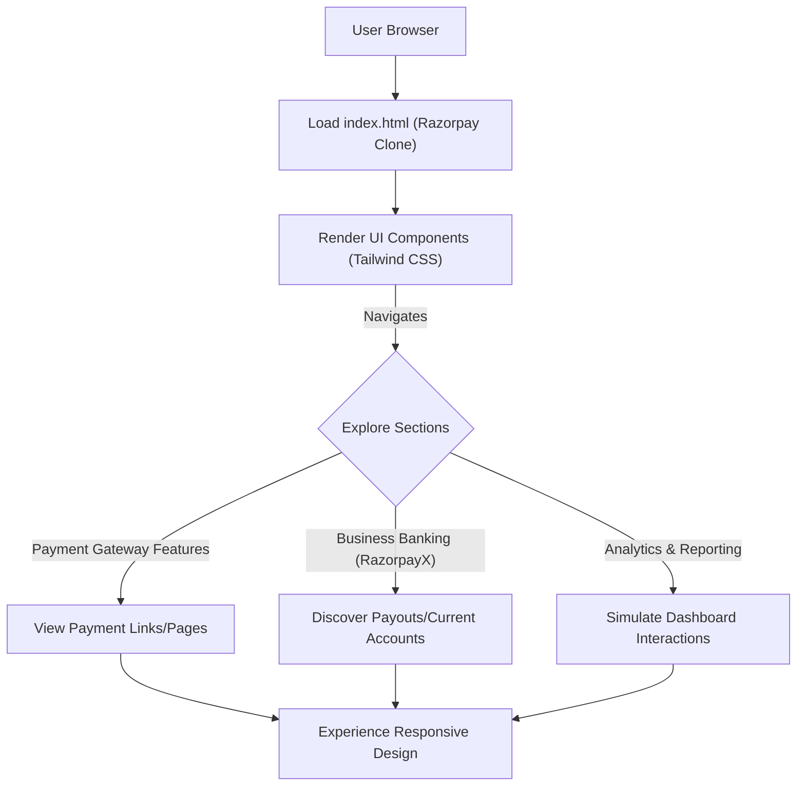

# 🚀 Razorpay Clone Frontend

<p align="center"></p>

## Short Description
Dive into a meticulously crafted frontend replication of the renowned Razorpay payment gateway interface. This project stands as a testament to modern web development, showcasing a pixel-perfect, responsive, and highly interactive user experience that mirrors the sophistication of a leading financial technology platform. Explore the intricate details of payment flows, business banking, and advanced dashboard layouts, all built with a keen eye for design and performance.

## ✨ Key Features
*   **Comprehensive Payment Gateway UI:** Experience the visual intricacies of a full-fledged payment processing interface, from checkout flows to detailed transaction views.
*   **Instant Settlement & Payouts Visualization:** See how features like instant settlements and business payouts are presented, ensuring clarity and transparency.
*   **Advanced Business Banking (RazorpayX) Integration:** A dedicated section demonstrating the UI/UX for corporate banking, current accounts, and automated payroll systems.
*   **Dynamic Dashboard & Reporting Layouts:** Explore mockups of analytics dashboards designed for merchants to track transactions, revenue, and customer insights.
*   **Robust Subscription Management Interface:** Visualize recurring payment setups, subscription plans, and customer management within the platform.
*   **Multiple Payment Options Showcase:** UI elements for various payment methods including Payment Links, Payment Pages, and Payment Buttons, illustrating flexibility.
*   **API-Driven Features Representation:** Visual cues indicating seamless integration capabilities, highlighting the platform's extensible nature.
*   **Modern & Secure UI Practices:** Demonstrating best practices in building a secure and trustworthy payment environment from a frontend perspective.

## Who is this for?
This project is an invaluable resource for:
*   **Frontend Developers:** A practical example of building complex, data-rich user interfaces with a focus on responsiveness and interactive elements.
*   **UI/UX Designers:** An excellent reference for design patterns, visual hierarchies, and user flows within a financial technology context.
*   **Students & Learners:** A fantastic codebase to understand modern HTML, CSS (especially Tailwind CSS), and how to structure a large-scale frontend application.
*   **Technical Marketers:** To understand the visual presentation of FinTech products and leverage it for demonstrations or educational content.

## Technology Stack & Architecture
This project is a pure frontend showcase, built with robust and modern web technologies to deliver a fluid and engaging user experience.

*   **HTML5:** The foundational structure of all web pages, ensuring semantic and accessible content.
*   **CSS3 (with Tailwind CSS):** Leverages the utility-first CSS framework, Tailwind CSS, for rapid and consistent styling, enabling highly customizable and responsive designs.
*   **JavaScript:** (Implied by `package.json`) Likely used for interactive elements, navigation, and dynamic content manipulation to enhance the user experience.
*   **Build Tools:** `postcss.config.js`, `package.json`, and `package-lock.json` indicate a modern development workflow, possibly involving npm/yarn for dependency management and PostCSS for CSS transformations.

The architecture is a **Static Single-Page Application (SPA)** focused entirely on frontend presentation. There is no explicit backend or database layer included within this repository, as its primary goal is to demonstrate the user-facing interface and its capabilities.

## 📊 Architecture & Database Schema
Given this is a frontend-focused clone, there is no underlying database schema. The architecture represents user interaction with the visual elements.



## ⚡ Quick Start Guide
To get this Razorpay clone up and running on your local machine, follow these simple steps:

1.  **Clone the repository:**
    ```bash
    git clone https://github.com/grewal16/Razorpay_clone.git
    cd Razorpay_clone
    ```
2.  **Install dependencies (if applicable):**
    This project uses `package.json`, suggesting development dependencies.
    ```bash
    npm install
    # or if you use yarn
    # yarn install
    ```
3.  **Run the development server or open directly:**
    If `package.json` contains a `start` or `dev` script:
    ```bash
    npm run dev
    # or
    # npm start
    ```
    Alternatively, for a purely static site, simply open `index.html` in your web browser:
    ```bash
    open index.html # on macOS
    # or
    # start index.html # on Windows
    ```

You should now see the Razorpay clone live in your browser!