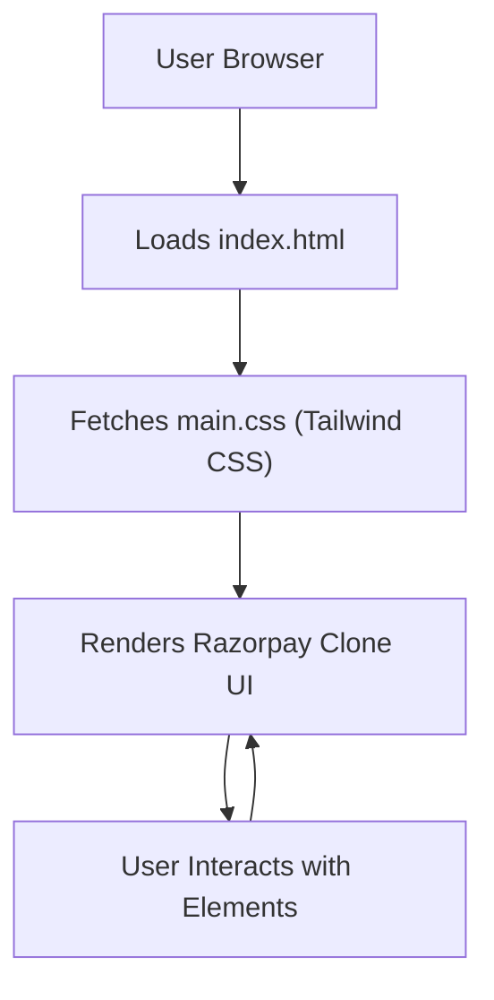

# 🚀 Razorpay_clone

<p align="center"></p>

## Short Description
Dive into a meticulously crafted front-end clone of the renowned Razorpay platform! This project showcases a modern, responsive, and feature-rich payment gateway interface, built to replicate the visual excellence and user experience of a leading fintech solution. It's a static web application, demonstrating pure UI/UX prowess in rendering complex payment and banking features.

## ✨ Key Features
*   **Stunning UI Replication:** A faithful recreation of the Razorpay interface, capturing its clean design and intuitive user flows.
*   **Comprehensive Payment Gateway Visuals:** Experience the simulated journey through various payment options, gateways, and checkout processes.
*   **Advanced Business Banking Features (RazorpayX):** Explore mock-ups of business banking functionalities, including current accounts, capital, and payout management.
*   **Dashboard & Reporting Insight:** Visualize a clean, data-driven UI for financial oversight and reporting, mirroring professional dashboards.
*   **Seamless Integration Design:** Understand the front-end presentation of API-driven solutions and easy integration points.
*   **Responsive & Modern Design:** Crafted with cutting-edge CSS frameworks to ensure an optimal viewing and interaction experience across all devices.
*   **Icon-Rich Interface:** Utilizes a vast collection of SVG icons to represent diverse functionalities, enhancing visual clarity.

## Who is this for?
*   **Front-end Developers:** Ideal for those seeking inspiration, a challenging project to dissect, or a practical example of replicating complex financial UIs.
*   **UI/UX Designers:** A great resource for studying modern financial web interfaces, interaction patterns, and visual hierarchies.
*   **Web Development Students:** An excellent hands-on project to learn and practice HTML, CSS (especially Tailwind CSS), and responsive design principles.
*   **Fintech Enthusiasts:** Anyone interested in the visual and structural design of leading payment and banking platforms.

## Technology Stack & Architecture
This project is a testament to robust front-end development, utilizing a modern and efficient stack:

*   **HTML5:** For structuring the core content and semantic layout of the web pages.
*   **CSS3:** The styling powerhouse, providing granular control over visual presentation.
*   **Tailwind CSS:** A utility-first CSS framework that enables rapid UI development with highly customizable styles directly in markup.
*   **PostCSS:** Used in conjunction with Tailwind CSS for processing and transforming CSS with JavaScript.
*   **NPM / Node.js:** For managing project dependencies and facilitating the build process for Tailwind CSS.

## 📊 Architecture & Database Schema
As a front-end UI clone, this project primarily focuses on client-side rendering and interaction. There is no backend database or complex server-side architecture involved. The user's browser handles all rendering.



## ⚡ Quick Start Guide
Get this stunning UI clone up and running in no time!

1.  **Clone the Repository:**
    ```bash
    git clone https://github.com/grewal16/Razorpay_clone.git
    ```
2.  **Navigate to Project Directory:**
    ```bash
    cd Razorpay_clone
    ```
3.  **Install Dependencies:**
    ```bash
    npm install
    ```
    *(This will install necessary packages, primarily Tailwind CSS and PostCSS, for local development.)*
4.  **Open in Browser:**
    Simply open the `index.html` file in your web browser. For a better development experience with live reloading, consider using a live server extension (e.g., in VS Code).