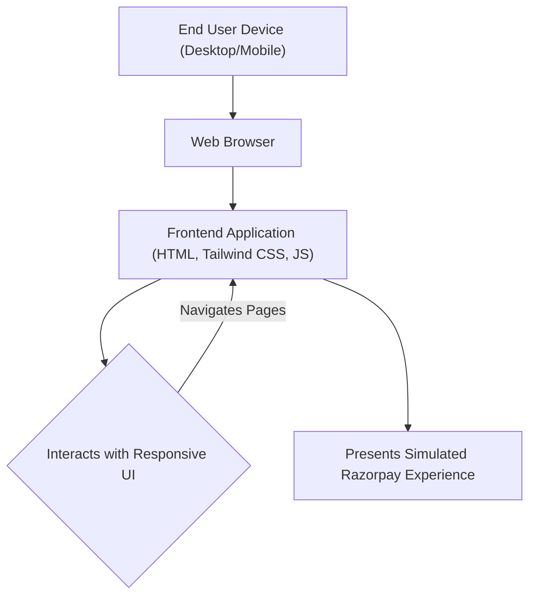

# 🚀 Razorpay_clone

<p align="center"></p>

## Short Description
Dive into a meticulously crafted frontend replication of the renowned Razorpay payment gateway interface! This project serves as a compelling demonstration of modern web development skills, faithfully recreating the user experience and visual aesthetics of a sophisticated financial platform. It's a vibrant showcase of responsive design, intuitive navigation, and a keen eye for detail, all built with a robust and modern stack.

## ✨ Key Features
*   **Stunning UI/UX Fidelity:** Experience a pixel-perfect recreation of Razorpay's engaging and user-friendly interface.
*   **Comprehensive Payment Suite Pages:** Explore various simulated sections including Payment Gateway, Payment Links, Payment Pages, and Payment Buttons.
*   **Advanced Business Banking Sections:** Discover replicated interfaces for RazorpayX features like Payouts, Corporate Cards, and Smart Collect.
*   **Dynamic Visual Elements:** Utilizes a rich set of SVG and PNG assets for icons, illustrations, and background elements, bringing the design to life.
*   **Responsive Design:** Engineered to look and perform beautifully across a multitude of devices and screen sizes.
*   **Developer-Friendly Structure:** Built with maintainable and scalable frontend code practices.

## Who is this for?
*   **Frontend Developers:** Looking for inspiration or a challenging project to hone their HTML, CSS, and framework skills.
*   **UI/UX Designers:** Interested in dissecting and understanding the design principles of a leading financial tech platform.
*   **Students & Learners:** Seeking a tangible example of a complex, real-world UI implemented from scratch.
*   **Tech Enthusiasts:** Curious about how modern web interfaces are constructed.

## Technology Stack & Architecture
This project is a testament to the power of a lean yet effective frontend technology stack, focusing purely on delivering an exceptional user interface.

*   **HTML5:** The foundational markup for structuring content.
*   **CSS3:** For styling, brought to life with:
    *   **Tailwind CSS:** A utility-first CSS framework for rapidly building custom designs.
    *   **PostCSS:** Used for transforming CSS with JavaScript plugins, enhancing the development workflow.
*   **JavaScript:** For interactive elements and dynamic user experiences.
*   **npm:** Used for package management to handle development dependencies (e.g., Tailwind CSS setup).

## 📊 Architecture & Database Schema
Given this project is a pure frontend UI clone, it does not involve a backend server or a database. The architecture is a direct client-side application.



## ⚡ Quick Start Guide
Get this powerful Razorpay clone up and running on your local machine in minutes!

1.  **Clone the Repository:**
    ```bash
    git clone https://github.com/grewal16/Razorpay_clone.git
    cd Razorpay_clone
    ```

2.  **Install Dependencies:**
    This project uses `npm` for managing development-related tools like Tailwind CSS.
    ```bash
    npm install
    ```

3.  **Build Tailwind CSS (if needed):**
    If you make changes to the `tailwind.config.js` or directly to `main.css`, you might need to recompile. The `package.json` often includes scripts for this.
    ```bash
    # Check package.json for specific build/watch scripts, e.g.:
    npm run build
    # or to watch for changes during development:
    npm run watch
    ```

4.  **Open in Your Browser:**
    Simply open the `index.html` file directly in your web browser to view the project.
    ```bash
    # Example (macOS):
    open index.html
    # Or navigate to the file path in your browser:
    file:///path/to/your/Razorpay_clone/index.html
    ```
    For a live development experience with hot-reloading and better asset management, consider using a local web server like `Live Server` VS Code extension or `http-server` via npm (`npm install -g http-server && http-server .`).