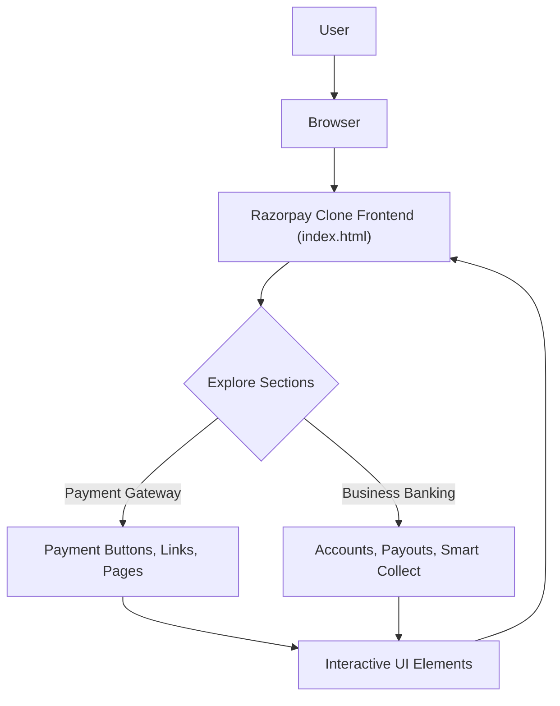

# 🚀 Razorpay Clone Frontend

<p align="center"></p>

## Short Description
Dive into the meticulously crafted **Razorpay Clone Frontend**, a stunning and highly responsive recreation of a leading financial technology platform's user interface. This project showcases a mastery of modern web development, meticulously replicating the intricate design, diverse feature sections, and intuitive user experience of a sophisticated payment gateway and business banking solution. It stands as a testament to pixel-perfect UI/UX replication using cutting-edge frontend technologies.

## ✨ Key Features
*   **Comprehensive Payment Gateway UI:** Experience a faithful reproduction of payment links, pages, buttons, and a seamless checkout flow, including Magic Checkout and UPI Autopay.
*   **Advanced Business Banking Interface:** Explore mockups for current accounts, payouts, smart collect, route functionalities, and capital & credit features, mimicking an integrated financial dashboard.
*   **Intuitive & API-Driven Design:** The frontend is structured to reflect an API-driven architecture, demonstrating how a robust UI can be built to support complex financial operations.
*   **Modern & Responsive Layouts:** Crafted with a mobile-first approach, ensuring a flawless experience across all devices, from desktops to smartphones.
*   **Visually Rich Components:** Utilizes a vast collection of custom icons, illustrations, and background elements to deliver an engaging and professional aesthetic.
*   **Security & Trust Elements:** Incorporates visual cues for industry-standard security and compliance, reflecting the trustworthiness of financial platforms.
*   **Easy Integration & Instant Activation:** UI elements hinting at simplified onboarding and quick setup processes.

## Who is this for?
This project is ideal for:
*   **Frontend Developers:** Looking for inspiration or a detailed example of replicating complex UIs.
*   **UI/UX Designers:** To study and understand the structural and aesthetic elements of a top-tier fintech platform.
*   **Learners:** Gaining practical experience in HTML, CSS (especially with Tailwind CSS), and modern web project structure.
*   **Portfolio Showcase:** An impressive demonstration of ability to build pixel-perfect, feature-rich web interfaces.

## Technology Stack & Architecture
This project is built as a highly optimized static site, focusing purely on frontend presentation and user interface.
*   **HTML5:** For semantic and structured content.
*   **CSS (Tailwind CSS & PostCSS):** For utility-first styling, rapid UI development, and efficient CSS management.
*   **Node.js (for Dev tooling):** Utilized for managing development dependencies such as Tailwind CSS compilation.

## 📊 Architecture & Database Schema
Given this is a frontend-focused clone, there is no backend architecture or database schema to display. The project represents the user's interaction flow with a static, but rich, web interface.



## ⚡ Quick Start Guide
To get this Razorpay Clone running locally, follow these simple steps:

1.  **Clone the repository:**
    ```bash
    git clone https://github.com/grewal16/Razorpay_clone.git
    cd Razorpay_clone
    ```
2.  **Install Dependencies:**
    This project uses Tailwind CSS, which requires Node.js and npm/yarn for compilation.
    ```bash
    npm install
    ```
3.  **Compile Tailwind CSS:**
    Run the Tailwind CLI to compile your `main.css` file. For development with live updates:
    ```bash
    npx tailwindcss -i ./main.css -o ./main.css --watch
    ```
    (Note: `main.css` is used as both input and output here. In larger projects, you might output to `dist/output.css` and link that in your `index.html`.)

4.  **Open in Browser:**
    Simply open the `index.html` file in your web browser:
    ```bash
    open index.html # On macOS
    # or
    start index.html # On Windows
    # or navigate manually
    ```
    You should now see the Razorpay clone interface!

## 📜 License
This project is licensed under the **ISC License**.

See the `package.json` file for more details.