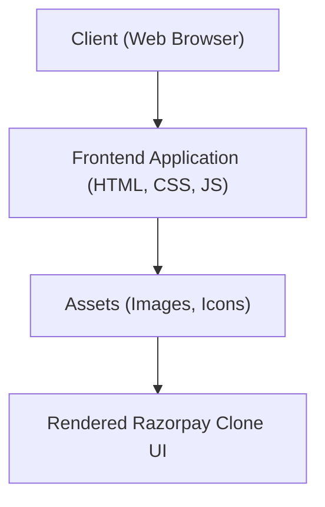

# 🚀 Razorpay UI Clone

<p align="center"></p>

## Short Description
Dive into the world of FinTech UI with this meticulously crafted frontend clone of the Razorpay website. This project showcases a visually stunning and highly responsive user interface, replicating the intricate design and dynamic feel of a leading payment gateway platform. Built with a focus on clean code and modern web standards, it's a testament to the power of contemporary frontend development.

## ✨ Key Features
*   **Pixel-Perfect Design**: A faithful recreation of the Razorpay website's aesthetics, ensuring visual accuracy.
*   **Comprehensive Payment Features**: Visual representations of core functionalities like Payment Gateway, Instant Settlements, UPI Autopay, and Magic Checkout.
*   **Business Banking & Payouts**: UI elements reflecting RazorpayX features, including business banking dashboards and payout management.
*   **Subscription Management**: Detailed interfaces for handling recurring payments and subscription cycles.
*   **API-Driven Integration**: Icons and sections hinting at seamless API integration capabilities.
*   **Dashboard & Reporting**: Visual insights into simulated transaction data and financial reports.
*   **Robust Security Elements**: Design cues emphasizing secure transactions and data protection.
*   **Responsive Layout**: Optimized for various screen sizes, providing a consistent experience across devices.

## Who is this for?
*   **Frontend Developers**: Aspiring and experienced developers looking to study advanced UI/UX implementation, responsive design patterns, and modern CSS frameworks like Tailwind CSS.
*   **UI/UX Designers**: A practical example of how complex financial interfaces are structured and designed.
*   **Students & Learners**: An excellent resource for understanding real-world application of HTML, CSS, and component-based UI structuring.
*   **Enthusiasts**: Anyone interested in the visual mechanics behind leading FinTech platforms.

## Technology Stack & Architecture

### Technology Stack
This project is purely a frontend application, leveraging a powerful and modern stack:
*   **HTML5**: For structuring the content and semantic web elements.
*   **CSS3**: For styling, with a strong emphasis on responsive design.
*   **Tailwind CSS**: A utility-first CSS framework for rapid and consistent styling.
*   **PostCSS**: For transforming CSS with JavaScript plugins, enhancing maintainability and compatibility.
*   **JavaScript**: (Implied) For interactive elements and dynamic UI behavior.
*   **npm/Yarn**: For managing frontend dependencies as indicated by `package.json` and `package-lock.json`.

## 📊 Architecture & Database Schema
This project is a static frontend UI clone and does not involve a backend server or database schema. The architecture focuses on client-side rendering.



## ⚡ Quick Start Guide
To get this Razorpay UI clone running on your local machine, follow these simple steps:

1.  **Clone the Repository**:
    ```bash
    git clone https://github.com/grewal16/Razorpay_clone.git
    cd Razorpay_clone
    ```

2.  **Install Dependencies**:
    While this is primarily a static HTML/CSS project, `package.json` suggests dev dependencies for Tailwind/PostCSS.
    ```bash
    npm install
    # or
    yarn install
    ```
    You might need to build the CSS if you make changes to Tailwind configuration:
    ```bash
    npm run build-css # or a similar script defined in package.json
    ```

3.  **Open the Application**:
    Simply open the `index.html` file in your preferred web browser.
    ```bash
    open index.html # on macOS
    start index.html # on Windows
    xdg-open index.html # on Linux
    ```
    You should now see the Razorpay UI clone rendered in your browser!