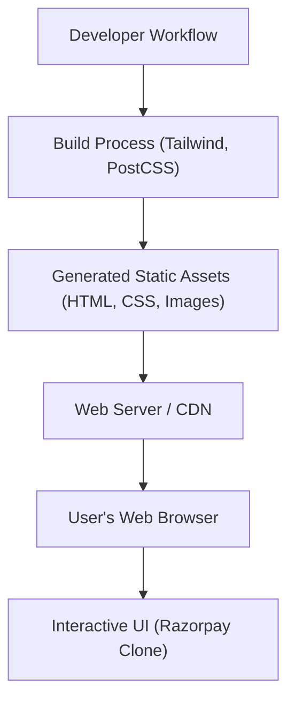

# 🚀 Razorpay UI Clone

<p align="center"></p>

## Short Description
Dive into a meticulously crafted, high-fidelity front-end clone of the Razorpay website! This project serves as a showcase of modern web development practices, replicating the dynamic and user-friendly interface of a leading payment gateway. Built with a focus on responsive design and clean architecture, it demonstrates proficiency in translating complex UI/UX designs into pixel-perfect web experiences.

## ✨ Key Features
*   **Stunning UI Replication:** A faithful recreation of Razorpay's public-facing interface, including sections for payment gateways, business banking, and developer resources.
*   **Comprehensive Payment Suite Showcase:** Visual elements for features like Instant Settlements, Magic Checkout, UPI Autopay, Payment Links, and Subscriptions.
*   **RazorpayX Business Banking Experience:** Dedicated sections reflecting the sleek design of RazorpayX, showcasing current accounts, payouts, and smart collect features.
*   **Developer-Friendly Design:** UI components hinting at API-driven solutions and easy integration.
*   **Responsive & Adaptive Design:** Optimized for a seamless experience across various devices and screen sizes, ensuring accessibility and usability.
*   **Modern CSS Utility Framework:** Leverages Tailwind CSS for rapid and consistent styling, promoting maintainable and scalable front-end code.

## Who is this for?
*   **Front-End Developers:** A fantastic resource for studying modern HTML and CSS (Tailwind CSS) implementation in a real-world context.
*   **UI/UX Designers:** Explore a production-grade interface design and its implementation details.
*   **Learners & Enthusiasts:** Understand how complex, professional websites are structured and styled from the ground up.
*   **Portfolio Showcase:** A powerful demonstration of your ability to build high-quality, responsive web interfaces.

## Technology Stack & Architecture
This project is a purely client-side rendering masterpiece, focusing on robust and modern front-end technologies:

*   **HTML5:** The semantic foundation for all content.
*   **CSS3:** Styled efficiently using the utility-first approach of **Tailwind CSS**, enhanced by **PostCSS** for modern CSS transformations.
*   **Node.js (Development Dependencies):** Utilized for managing build tools and dependencies (`package.json`, `package-lock.json`), primarily for Tailwind CSS compilation.

## 📊 Architecture & Database Schema
This project is a static front-end application, so there's no backend server or database schema. The architecture represents the development and deployment flow for serving static web assets.



## ⚡ Quick Start Guide
To get this Razorpay UI clone up and running on your local machine:

1.  **Clone the repository:**
    ```bash
    git clone https://github.com/grewal16/Razorpay_clone.git
    cd Razorpay_clone
    ```
2.  **Install dependencies:**
    This project uses Node.js for managing build tools (like Tailwind CSS). Ensure you have Node.js and npm installed.
    ```bash
    npm install
    ```
3.  **Build CSS (if needed):**
    Tailwind CSS typically requires a build step. You might need to run a build script or a watcher during development. Check `package.json` for specific scripts. A common command might be:
    ```bash
    npx tailwindcss -i ./main.css -o ./output.css --watch
    ```
    *(Note: Replace `main.css` and `output.css` with your actual input/output files if they differ.)*
4.  **Open in browser:**
    Simply open the `index.html` file in your preferred web browser. All assets are self-contained and ready to render!
    ```bash
    open index.html # on macOS
    start index.html # on Windows
    xdg-open index.html # on Linux
    ```