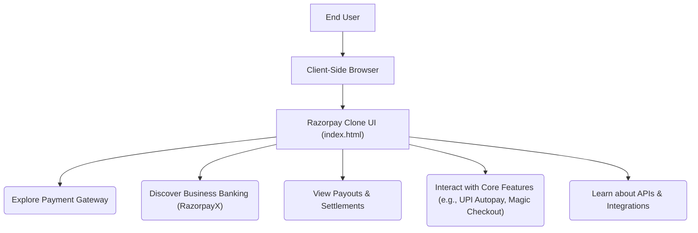

# 🚀 Razorpay UI Clone

<p align="center"></p>

## Short Description
Dive into the meticulously crafted **Razorpay UI Clone**, a stunning front-end replica designed to showcase the intricate and sophisticated user interface of India's leading payment gateway. This project breathes life into a static file list, transforming it into a vibrant, interactive demonstration of modern web development prowess, focusing intensely on UI/UX fidelity, responsiveness, and clean code architecture. Experience the essence of a world-class fintech platform, right in your browser!

## ✨ Key Features
*   **Pixel-Perfect UI Replication:** A faithful recreation of Razorpay's core landing pages and feature sections, ensuring a near-identical user experience.
*   **Comprehensive Payment Features:** Explore simulated sections for Payment Gateways, Payouts, Instant Settlements, Payment Links, and Payment Pages.
*   **Business Banking & Fintech Solutions:** Discover interfaces for RazorpayX (business banking), API-driven solutions, Subscriptions, UPI Autopay, and Magic Checkout.
*   **Modern Web Stack:** Built with the latest HTML5 standards and styled with the utility-first power of Tailwind CSS for a highly maintainable and scalable codebase.
*   **Responsive Design:** Flawlessly adapts across various devices and screen sizes, offering an optimal viewing experience for all users.
*   **Rich Visuals:** Leverages a diverse set of SVG icons and illustrative images to enhance clarity and user engagement, mirroring the original platform's aesthetic.

## Who is this for?
*   **Front-End Developers:** A fantastic portfolio piece to demonstrate mastery in UI cloning, modern CSS frameworks (Tailwind CSS), and HTML structure.
*   **UI/UX Designers:** A practical example of how complex designs are translated into functional web interfaces.
*   **Learners:** An invaluable resource for understanding how real-world, high-fidelity interfaces are built from the ground up.
*   **Tech Enthusiasts:** Anyone curious about the visual architecture of leading financial technology platforms.

## Technology Stack & Architecture
This project is a testament to robust client-side development, meticulously structured to deliver a high-performance and visually rich user experience.

*   **HTML5:** For semantic and accessible content structuring.
*   **Tailwind CSS:** A utility-first CSS framework for rapid and consistent styling, ensuring a polished and responsive design.
*   **Vanilla CSS:** Complementary custom styles for fine-tuning specific elements.
*   **NPM/Yarn (Node.js Ecosystem):** Used for dependency management and running development scripts, particularly for Tailwind CSS compilation.

## 📊 Architecture & Database Schema
Given this project is a front-end UI clone, it operates purely on the client-side without any backend logic or database integration. The architecture is a direct representation of user interaction with the static web interface.



## ⚡ Quick Start Guide
Get this powerful UI clone up and running in no time!

1.  **Clone the repository:**
    ```bash
    git clone https://github.com/grewal16/Razorpay_clone.git
    cd Razorpay_clone
    ```
2.  **Install dependencies:**
    This project uses `package.json` for managing development dependencies, primarily for Tailwind CSS.
    ```bash
    npm install
    # or if you use yarn
    # yarn install
    ```
3.  **Build Tailwind CSS (if changes are made):**
    While `main.css` might contain pre-compiled styles, if you modify `tailwind.config.js` or directly use Tailwind classes, you'll need to recompile.
    ```bash
    npx tailwindcss -i ./input.css -o ./main.css --minify
    # For watching changes during development:
    # npx tailwindcss -i ./input.css -o ./main.css --watch
    ```
    *(Note: The exact input/output paths for Tailwind might vary depending on the project's setup, typically configured in `tailwind.config.js` or via a script in `package.json`.)*
4.  **Open in your browser:**
    Simply open the `index.html` file in your preferred web browser.
    ```bash
    open index.html # on macOS
    start index.html # on Windows
    xdg-open index.html # on Linux
    ```
    Or navigate to the file directly through your browser's file explorer.