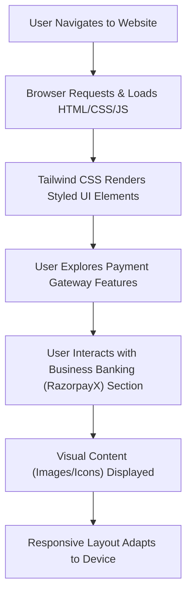

# 🚀 Razorpay_clone

<p align="center"></p>

## Short Description
Dive into a meticulously crafted front-end clone of the Razorpay website, a leading financial technology platform. This project showcases a stunningly accurate recreation of Razorpay's modern user interface, bringing to life its core features like payment gateways, business banking, and integrated solutions, all built with a keen eye for detail and responsive design. Experience the elegance and functionality of a world-class fintech UI, right in your browser!

## ✨ Key Features
*   **Pristine UI/UX Replication:** A pixel-perfect front-end clone mirroring the official Razorpay website design, ensuring a familiar and intuitive user experience.
*   **Comprehensive Payment Gateway Visuals:** Explore visually represented features including secure payment processing, multiple payment modes, instant settlements, magic checkout flows, payment buttons, and subscription management.
*   **RazorpayX Business Banking Insights:** Delve into the simulated interface of RazorpayX, showcasing features like current accounts, instant payouts, smart collect, and capital & credit solutions.
*   **Dynamic & Responsive Layouts:** Built with modern web standards to ensure a seamless experience across various devices and screen sizes.
*   **Feature-rich Iconography & Illustrations:** Integrates a wide array of SVG icons and illustrative graphics to enhance visual appeal and feature communication, including API-driven workflows, easy integration, and dashboard reporting.
*   **Developer-Friendly Structure:** A clean and organized codebase, making it an excellent resource for learning front-end development and UI cloning techniques.

## Who is this for?
*   **Front-end Developers:** A fantastic reference for mastering modern CSS frameworks like Tailwind CSS, HTML5 structuring, and responsive design.
*   **UI/UX Designers:** Study a real-world example of a sophisticated fintech interface and its implementation.
*   **Students & Learners:** An invaluable project for understanding how complex, interactive web pages are structured and styled.
*   **Technical Marketers:** See how compelling feature sets are presented visually and explore design patterns used by industry leaders.
*   **Anyone Interested in FinTech UI:** Get a hands-on feel for the user experience offered by a premier payment gateway.

## Technology Stack & Architecture
This project is a testament to robust front-end development, focusing on delivering a rich user experience purely through client-side technologies.

*   **HTML5:** The foundational markup for structuring content and defining the web page layout.
*   **CSS3:** Styling rules defining the visual presentation of the website.
*   **Tailwind CSS:** A utility-first CSS framework enabling rapid UI development and highly customizable designs.
*   **PostCSS:** Used in conjunction with Tailwind CSS for processing and optimizing CSS.
*   **Node.js & npm:** For managing project dependencies and running build scripts (e.g., Tailwind CSS compilation).

This architecture represents a static site, highly optimized for performance and maintainability, driven by a modern front-end build pipeline.

## 📊 Architecture & Database Schema
Given that this is a front-end clone of a website, there is no traditional backend architecture or database schema involved. The project focuses solely on the client-side presentation. Below is a high-level flowchart illustrating the user's interaction with this static web application.



## ⚡ Quick Start Guide
To get this Razorpay clone up and running on your local machine, follow these simple steps:

1.  **Clone the Repository:**
    ```bash
    git clone https://github.com/grewal16/Razorpay_clone.git
    cd Razorpay_clone
    ```

2.  **Install Dependencies:**
    This project uses Node.js and npm for managing build tools (like Tailwind CSS).
    ```bash
    npm install
    ```

3.  **Run Development Server (Optional, for Live Reloading):**
    If you wish to make changes and see them instantly with live reloading, you might need a local development server. While `package.json` usually contains scripts, for a static site, you can often just open the `index.html`.
    ```bash
    # Check package.json for specific scripts like 'npm start' or 'npm run dev'
    # If no such script exists, or for a quick view:
    npm run tailwind-watch # or similar script if available to watch for CSS changes
    ```

4.  **Open the Project:**
    Simply open the `index.html` file in your preferred web browser.
    ```bash
    open index.html # On macOS
    start index.html # On Windows
    # Or manually navigate to the file in your browser
    ```
    You should now see the Razorpay clone website!

## 📜 License
No license file was explicitly found in the repository, implying standard GitHub default licensing for public repositories or no specific license specified.