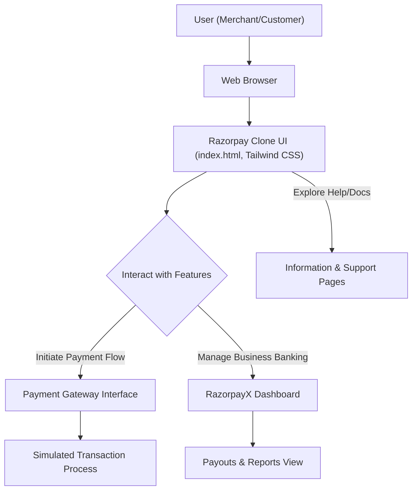

# 🚀 Razorpay Clone: Modern Payment Gateway Interface

<p align="center"></p>

## Short Description
Dive into the meticulously crafted frontend clone of the Razorpay payment gateway interface. This project showcases a stunning, responsive, and feature-rich UI, replicating the elegant design and robust user experience of a leading FinTech platform. It's a testament to modern web development practices, offering a comprehensive visual representation of a sophisticated payment ecosystem.

## ✨ Key Features
*   **Pixel-Perfect UI Replication**: Experience the familiar and intuitive design of Razorpay's diverse pages, from payment gateways to business banking solutions.
*   **Comprehensive Payment Suite**: Explore mockups for various payment modes including cards, net banking, UPI, and wallets, along with features like UPI Autopay and Magic Checkout.
*   **Business Banking Excellence (RazorpayX)**: Visualize advanced business banking functionalities, including payouts, smart collect, and automated bookkeeping.
*   **Dynamic Dashboard & Reporting**: Interact with a simulated dashboard providing insights into transactions, settlements, and financial data.
*   **Seamless Integration Design**: Observe the UI elements designed for easy integration, highlighting API-driven capabilities.
*   **Subscription & Payment Links**: Discover interfaces for managing recurring payments and generating quick payment links.
*   **Responsive Across Devices**: Crafted with a mobile-first approach, ensuring a flawless experience on any screen size.
*   **Modern Web Technologies**: Built leveraging the power of HTML5, Tailwind CSS, and PostCSS for a highly maintainable and scalable frontend.

## Who is this for?
This project is an invaluable resource for:
*   **Frontend Developers**: Seeking inspiration, learning modern UI implementation with Tailwind CSS, or showcasing their ability to replicate complex interfaces.
*   **UI/UX Designers**: To study the intricacies of a high-traffic FinTech platform's user experience and visual design.
*   **FinTech Enthusiasts**: Interested in understanding the user-facing components of a leading payment gateway.
*   **Businesses & Startups**: Looking for a reference point or a demonstration of potential UI for their own payment solutions.

## Technology Stack & Architecture
This project is primarily a **frontend-focused application** built with:

*   **HTML5**: For structuring the content and semantics of the web pages.
*   **CSS3 (Tailwind CSS & PostCSS)**: Utilizes the utility-first CSS framework Tailwind CSS for rapid and consistent styling, processed with PostCSS for enhanced capabilities.
*   **JavaScript (Implied)**: While not explicitly heavy on custom JS files, the interactivity and dynamic aspects of the UI are inferred to be powered by modern JavaScript.

## 📊 Architecture & Database Schema
Given this is a frontend-centric clone, a traditional backend architecture or database schema is not present. Instead, the focus is on the user's interaction journey through the highly detailed and interactive user interface.



## ⚡ Quick Start Guide
To get this Razorpay clone up and running on your local machine, follow these simple steps:

1.  **Clone the repository:**
    ```bash
    git clone https://github.com/grewal16/Razorpay_clone.git
    ```
2.  **Navigate to the project directory:**
    ```bash
    cd Razorpay_clone
    ```
3.  **Open the main page:**
    Simply open the `index.html` file in your preferred web browser. All styles are integrated, and you should immediately see the live interface.
    ```bash
    # Example using a browser command (may vary by OS)
    # open index.html # For macOS
    # start index.html # For Windows
    # xdg-open index.html # For Linux
    ```

    *Note: For local development involving Tailwind CSS compilation (if modifying styles), you might need Node.js and npm installed. Run `npm install` and then use `npx tailwindcss -i ./main.css -o ./dist/output.css --watch` if `main.css` is intended as an input to generate output CSS.*