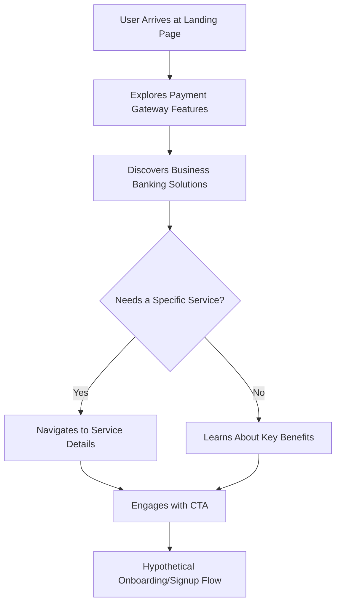

# 🚀 Razorpay Clone: Reinventing Digital Payments

<p align="center"></p>

## Short Description

Dive into the meticulously crafted **Razorpay Clone**, a high-fidelity front-end replication of the cutting-edge payment gateway and business banking platform. This project showcases a robust and visually stunning user interface, bringing to life the seamless experience of managing digital payments, payouts, and financial operations. Built with modern web technologies, it provides a comprehensive demonstration of how a leading fintech platform presents its diverse suite of services.

## ✨ Key Features

*   **Comprehensive Payment Gateway UI:** Experience the user flow for various payment modes and seamless checkout processes.
*   **Intuitive Business Banking Dashboard:** Explore simulated interfaces for managing current accounts, smart collect, and capital & credit.
*   **Instant Settlements & Payouts:** Visual representation of streamlined fund transfers and instant settlement capabilities.
*   **Automated UPI & Subscription Management:** Showcasing the UI for recurring payments and UPI Autopay features.
*   **API-Driven Solutions Showcase:** Demonstrating the ease of integration and power of an API-first approach.
*   **Enhanced Security & Robust Reporting:** Features emphasizing secure transactions and comprehensive financial reporting.
*   **Responsive & Modern Design:** A pixel-perfect recreation ensuring an optimal experience across all devices, powered by Tailwind CSS.

## Who is this for?

This project is ideal for:

*   **Front-end Developers:** Looking for a complex UI challenge and a real-world application of modern CSS frameworks like Tailwind CSS.
*   **Fintech Enthusiasts:** Interested in understanding the user experience and feature sets of leading payment platforms.
*   **UI/UX Designers:** Seeking inspiration or a reference for designing sophisticated financial dashboards and payment flows.
*   **Learners:** Anyone wanting to delve into HTML, CSS, and modern web development practices by dissecting an advanced project.

## Technology Stack & Architecture

This project is a pure front-end masterpiece, engineered with precision and modern web standards:

*   **HTML5:** For structuring the rich content and interactive elements.
*   **CSS3:** Styling the application with a contemporary and polished aesthetic.
*   **Tailwind CSS:** A utility-first CSS framework for rapid and consistent UI development.
*   **PostCSS:** For transforming CSS with JavaScript plugins, enhancing maintainability and compatibility.
*   **NPM:** Used for managing front-end development dependencies and build tooling.

## 📊 Architecture & Database Schema

As a front-end-focused replication, this project primarily concerns itself with user interface and experience. There is no server-side component or database schema in this repository. The high-level user interaction flow can be visualized as:



## ⚡ Quick Start Guide

Getting this Razorpay clone up and running on your local machine is straightforward:

1.  **Clone the Repository:**
    ```bash
    git clone https://github.com/grewal16/Razorpay_clone.git
    cd Razorpay_clone
    ```

2.  **Install Dependencies:**
    This project uses `npm` for managing dev dependencies, primarily for Tailwind CSS compilation.
    ```bash
    npm install
    ```

3.  **Build Tailwind CSS (if needed for development):**
    If you plan to modify the CSS, you'll need to compile Tailwind.
    ```bash
    npx tailwindcss -i ./main.css -o ./output.css --watch
    ```
    *(Note: The `index.html` might link directly to `main.css` or a compiled `output.css`. Inspect `index.html` to confirm the correct CSS path. For just viewing, typically `index.html` would already point to the correct, potentially pre-compiled, CSS.)*

4.  **Open in Browser:**
    Simply open the `index.html` file in your web browser.
    ```bash
    open index.html # On macOS
    # or
    start index.html # On Windows
    ```
    You should now see the Razorpay clone homepage!