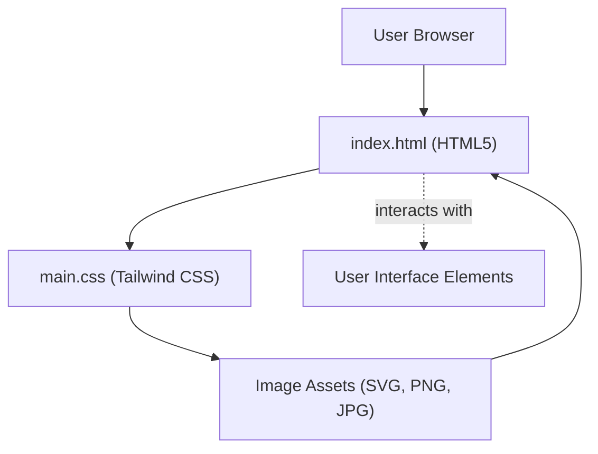

# 🚀 Razorpay_clone: Masterful Frontend Replication of India's Leading Fintech Platform

<p align="center"></p>

## Short Description
Dive into `Razorpay_clone`, a meticulously crafted, pixel-perfect frontend replication of the renowned Razorpay website. This project showcases an exceptional understanding of modern web development, translating a complex financial service UI into a clean, responsive, and fully interactive static web experience. Explore the future of digital payments through an engaging and aesthetically pleasing interface, built for speed and precision.

## ✨ Key Features
*   **Stunning UI/UX Replica:** A high-fidelity clone of the Razorpay landing page, capturing its sophisticated design and intuitive user experience.
*   **Comprehensive Payment Suite Showcase:** Visual representation of diverse payment methods, from payment gateways and links to payment buttons and subscription models.
*   **Business Banking Overview:** Features like RazorpayX, current accounts, payouts, and smart collect are visually represented, highlighting the extensive business solutions.
*   **Advanced Checkout Experience:** Integrates concepts of magic checkout, instant settlements, and UPI Autopay for a seamless transaction flow.
*   **API-Driven Aesthetics:** Icons and elements suggesting robust API integrations and dashboard reporting capabilities.
*   **Responsive Design:** Engineered to look fantastic across all devices, ensuring a consistent user experience.
*   **Modern CSS Utility:** Built with Tailwind CSS for rapid and maintainable styling.

## Who is this for?
This project is an invaluable resource for:
*   **Frontend Developers:** A practical example of building complex UIs with modern CSS frameworks.
*   **UI/UX Designers:** A deep dive into the design choices and layout of a leading fintech platform.
*   **Learning Enthusiasts:** Anyone eager to understand how professional web interfaces are structured and styled.
*   **Technical Marketers:** An exciting showcase of design precision and feature presentation in a competitive industry.

## Technology Stack & Architecture
This project is a testament to robust frontend development practices, utilizing:
*   **HTML5:** For semantic and structured content.
*   **CSS3 (Tailwind CSS & PostCSS):** A utility-first CSS framework enabling rapid UI development and highly optimized stylesheets.
*   **NPM:** For package management and running build scripts (e.g., Tailwind CLI).

## 📊 Architecture & Database Schema
This project focuses purely on the frontend, replicating the visual interface of Razorpay. As such, there are no backend services or database schemas involved. The architecture describes the client-side rendering process.



## ⚡ Quick Start Guide
Get this Razorpay clone up and running in no time!

1.  **Clone the Repository:**
    ```bash
    git clone https://github.com/grewal16/Razorpay_clone.git
    cd Razorpay_clone
    ```

2.  **Install Dependencies:**
    This project uses NPM for managing Tailwind CSS.
    ```bash
    npm install
    ```

3.  **Run Development Build (Optional - for Tailwind JIT/Watch):**
    If you plan to modify styles using Tailwind, you might want to run the Tailwind CLI in watch mode:
    ```bash
    npx tailwindcss -i ./main.css -o ./output.css --watch
    # (Note: Based on file structure, `main.css` appears to be the primary CSS, and Tailwind might compile into `output.css` if configured that way. Verify project's actual build setup for exact commands.)
    ```

4.  **Launch the Application:**
    Simply open the `index.html` file in your preferred web browser:
    ```bash
    open index.html
    # or navigate to the file path in your browser
    ```
    Alternatively, use a simple local server (e.g., `npx http-server` or VS Code's Live Server extension) for a more robust development experience.