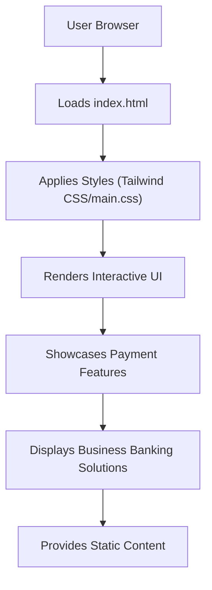

# 🚀 Razorpay Clone Frontend

<p align="center"></p>

## Short Description
Dive into a meticulously crafted, pixel-perfect frontend clone of the renowned payment gateway, Razorpay. This project showcases an exceptional understanding of modern web design principles and frontend development, replicating the dynamic and feature-rich user interface of one of India's leading financial technology platforms. Experience a robust, responsive, and visually stunning web application that highlights various payment solutions and business banking features, all built with an unwavering attention to detail.

## ✨ Key Features
*   **Intuitive Payment Gateway:** Explore a comprehensive UI reflecting payment processing capabilities, from accepting diverse payment modes to managing transactions.
*   **RazorpayX Business Banking:** Delve into the interface for business banking solutions, including current accounts, payouts, and smart collect functionalities.
*   **Advanced Payment Tools:** Discover features like Magic Checkout, Payment Buttons, Payment Links, and Payment Pages for streamlined online transactions.
*   **Subscription Management:** Visualize recurring payment setups and management through a dedicated UI section.
*   **API-Driven Insights:** Acknowledge the visual representation of an API-driven ecosystem, promoting easy integration and transparent reporting.
*   **Instant Settlements & Robust Security:** The design emphasizes rapid fund settlements and a secure transactional environment, crucial for fintech platforms.
*   **Responsive Design:** Flawlessly adapts across various devices, ensuring an optimal user experience whether on desktop or mobile.
*   **Modern UI/UX:** A clean, contemporary design with smooth animations and interactive elements, mirroring the original Razorpay experience.

## Who is this for?
This project is an invaluable resource for:
*   **Aspiring Frontend Developers:** A superb example for learning advanced HTML, CSS (Tailwind), and responsive design by dissecting a real-world, complex UI.
*   **UI/UX Designers:** A practical case study for understanding how a leading fintech company structures its web interface and user flows.
*   **Product Managers:** Gain insights into the various features and offerings of a payment gateway, presented in a clear and engaging manner.
*   **Anyone interested in Fintech:** An accessible way to explore the visual aspects of online payment processing and business banking without the backend complexities.

## Technology Stack & Architecture
This project is a pure frontend implementation, meticulously structured using cutting-edge web technologies to deliver a high-fidelity clone experience.

*   **HTML5:** The backbone for structuring the content and semantics of the web pages.
*   **CSS3 & Tailwind CSS:** Styled with modern CSS practices and enhanced by the utility-first framework Tailwind CSS for rapid and consistent styling. PostCSS is leveraged for efficient CSS processing.
*   **Node.js (for tooling):** Utilizes the Node.js ecosystem for development tools and dependency management (e.g., `package.json`).

## 📊 Architecture & Database Schema
Given this project is a frontend clone focused purely on the user interface and experience, a traditional database schema is not applicable. Instead, we present a high-level overview of the static frontend architecture:



## ⚡ Quick Start Guide

To get this stunning Razorpay clone up and running on your local machine, follow these simple steps:

1.  **Clone the Repository:**
    ```bash
    git clone https://github.com/grewal16/Razorpay_clone.git
    ```
2.  **Navigate to the Project Directory:**
    ```bash
    cd Razorpay_clone
    ```
3.  **Install Dependencies:** (If you intend to modify or compile Tailwind CSS)
    ```bash
    npm install
    ```
4.  **Open in Your Browser:**
    Simply open the `index.html` file in your preferred web browser to view the project.
    ```bash
    open index.html
    ```
    (On Windows, you might use `start index.html`)

You are now ready to explore the Razorpay Clone frontend!