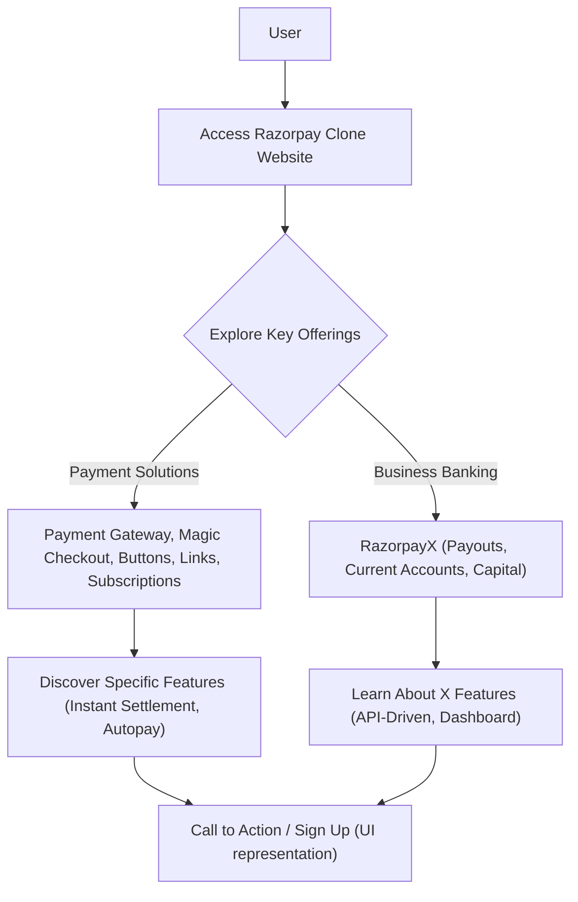

# 🚀 Razorpay Clone Frontend

<p align="center"></p>

<p align="center">
  <a href="https://github.com/grewal16/Razorpay_clone/stargazers"></a>
  <a href="https://github.com/grewal16/Razorpay_clone/network/members"></a>
  <a href="https://github.com/grewal16/Razorpay_clone/issues"></a>
</p>

## Short Description
Dive into a meticulously crafted frontend clone of the renowned Razorpay payment gateway interface! This project replicates the sophisticated UI/UX of Razorpay's website, showcasing modern web development practices with a strong emphasis on responsive design and a clean, feature-rich presentation. Experience the elegance of a leading fintech platform reimagined in pure frontend code.

## ✨ Key Features
*   **Intuitive Payment Gateway UI:** A seamless and visually appealing representation of a modern payment processing interface.
*   **Comprehensive Service Overview:** Sections dedicated to payment solutions like Payment Gateway, Magic Checkout, Payment Buttons, Payment Links, and Subscriptions.
*   **RazorpayX Business Banking:** Explore the frontend elements for business banking functionalities, including Payouts, Current Accounts, and Capital & Credit.
*   **Instant Settlement & Autopay:** Highlighted features for rapid fund transfers and automated payments.
*   **API-Driven Integration:** Frontend design reflecting easy integration points for developers.
*   **Dashboard & Reporting Views:** Mockup components suggesting rich analytics and reporting capabilities.
*   **Robust Security & Simple Pricing:** Visually articulated trust factors and clear pricing models.
*   **Responsive Design:** Optimized for a flawless experience across various devices.

## Who is this for?
This project is an invaluable resource for:
*   **Frontend Developers:** A fantastic reference for building complex, data-rich user interfaces and mastering modern CSS frameworks.
*   **UI/UX Designers:** Gain insights into how leading fintech platforms structure their user experience and visual hierarchy.
*   **Aspiring Web Developers:** A hands-on project to understand the structure of professional web pages and implement responsive layouts.
*   **Tailwind CSS Enthusiasts:** See practical, real-world application of Tailwind CSS for rapid and consistent styling.

## Technology Stack & Architecture
This project is a pure frontend endeavor, built with performance and developer experience in mind:

*   **HTML5:** The structural backbone, ensuring semantic and accessible content.
*   **CSS3 & Tailwind CSS:** Styling is powered by a custom `main.css` alongside the highly efficient and utility-first framework, Tailwind CSS, processed by PostCSS. This setup allows for rapid UI development and easy customization.
*   **Node.js / npm:** Utilized for managing development dependencies and running build scripts for Tailwind CSS.

## 📊 Architecture & Database Schema
Given this project is a purely frontend UI clone, it does not involve a backend architecture or a database schema. Instead, its "architecture" lies in the organization of its user interface and the flow a user experiences when navigating the replicated website. The diagram below illustrates a high-level user journey through the application's core sections.



## ⚡ Quick Start Guide
Get this powerful frontend clone up and running on your local machine with these simple steps:

1.  **Clone the repository:**
    ```bash
    git clone https://github.com/grewal16/Razorpay_clone.git
    cd Razorpay_clone
    ```

2.  **Install Dependencies:**
    This project uses `npm` for managing frontend tooling, primarily Tailwind CSS.
    ```bash
    npm install
    ```

3.  **Run Tailwind CSS Watch:**
    To ensure Tailwind CSS is actively compiling your styles, run the watch command. This will generate the necessary CSS in `build/tailwind.css` (or similar, check `tailwind.config.js`).
    ```bash
    npm run tailwind:watch
    # Or, if that script isn't explicitly defined, try:
    # npx tailwindcss -i ./main.css -o ./build/tailwind.css --watch
    ```

4.  **Open in Browser:**
    Simply open the `index.html` file in your preferred web browser.
    ```bash
    open index.html # On macOS
    # Or navigate manually through your file explorer
    ```
    You should now see the Razorpay clone website!