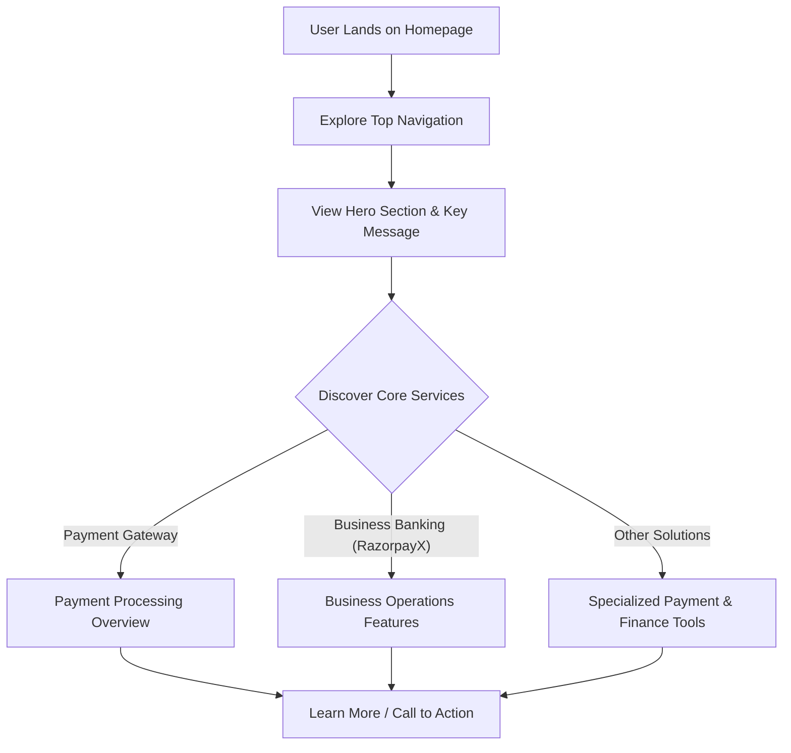

# 🚀 Razorpay UI Clone

<p align="center"></p>

## Short Description
Embark on a journey through the meticulously crafted front-end clone of Razorpay, a leading fintech platform. This project serves as a stunning showcase of modern web development, replicating the iconic user interface and core visual features of Razorpay. It's built to demonstrate robust front-end architecture, responsive design, and an attention to detail that brings a complex financial service UI to life.

## ✨ Key Features
*   **Pixel-Perfect UI Replication:** A faithful recreation of the Razorpay website's design, ensuring an authentic look and feel.
*   **Responsive Design:** Flawless adaptation across various devices, from desktop to mobile, providing an optimal user experience everywhere.
*   **Comprehensive Feature Showcase:** Visual representation of key payment and business banking functionalities, including:
    *   **Payment Gateway & Links:** Intuitive interfaces for accepting and managing payments.
    *   **Instant Settlements & Payouts:** Visual cues for rapid fund transfers.
    *   **RazorpayX Business Banking:** Dedicated sections for business financial management.
    *   **UPI Autopay & Subscriptions:** Recurring payment solutions.
    *   **Magic Checkout & Payment Buttons:** Streamlined transaction flows.
    *   **Dashboard & Reporting:** Visually rich data insights (UI only).
*   **Modern CSS Framework:** Leveraging the power of Tailwind CSS for efficient, scalable, and maintainable styling.
*   **Interactive Elements:** Engaging user experience with hover effects and illustrative graphics.

## Who is this for?
This project is ideal for:
*   **Front-end Developers:** Aspiring and experienced developers looking for a practical example of building complex, responsive web interfaces with modern tools.
*   **UI/UX Designers:** To study and deconstruct the design patterns and user flows of a prominent fintech platform.
*   **Technical Marketers:** To understand how compelling product narratives can be visually translated into a website.
*   **Anyone learning Web Development:** A fantastic resource for understanding HTML structure, advanced CSS, and responsive design principles.

## Technology Stack & Architecture
This project is a pure front-end application, focusing on delivering a high-fidelity visual experience.

*   **HTML5:** For semantic and structured web content.
*   **CSS3:** For styling, enhanced with custom properties and modern techniques.
*   **Tailwind CSS:** A utility-first CSS framework for rapid UI development and consistent styling.
*   **PostCSS:** For transforming CSS with JavaScript plugins, enabling features like autoprefixing and purging unused styles.
*   **NPM (Node Package Manager):** For managing project dependencies and build scripts.

## 📊 Architecture & Database Schema
Given this is a front-end UI clone, there is no backend server or database schema. The architecture represents the user's journey through the presented features.



## ⚡ Quick Start Guide
Get this powerful front-end clone up and running in no time!

1.  **Clone the repository:**
    ```bash
    git clone https://github.com/grewal16/Razorpay_clone.git
    cd Razorpay_clone
    ```
2.  **Install dependencies:**
    This project uses npm for package management, primarily for Tailwind CSS build tools.
    ```bash
    npm install
    ```
3.  **Run the development server (if configured) or open directly:**
    If `package.json` contains a `start` or `dev` script, use that. Otherwise, simply open the `index.html` file in your browser.
    ```bash
    # Check package.json for specific scripts, e.g.,
    # npm run dev
    # OR
    # Open index.html directly in your web browser.
    ```

## 📜 License
No license file was found within the repository, implying standard GitHub default licensing practices apply.