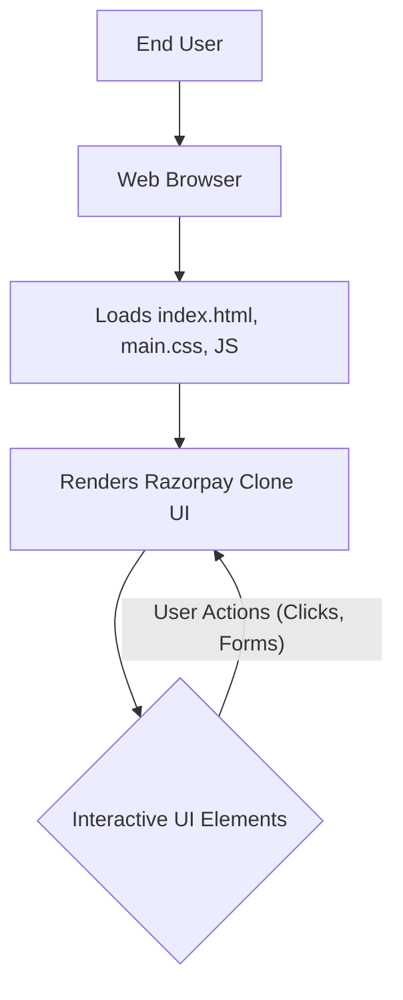

# 🚀 Razorpay_clone

<p align="center"></p>

## Short Description
Dive into the exquisite world of modern financial interfaces with **Razorpay_clone** – a meticulously crafted, high-fidelity frontend replica of the renowned Razorpay platform. This project showcases a stunning UI/UX, demonstrating best practices in web design and responsiveness for payment gateways and business banking solutions. It's a testament to pixel-perfect design and intuitive user flows, engineered entirely with cutting-edge frontend technologies.

## ✨ Key Features
*   **Comprehensive Payment Gateway UI:** Experience a polished interface mimicking a robust payment processing system, including various payment modes and checkout flows.
*   **Intuitive Business Banking & Payouts:** Explore the visual design for managing business finances, reflecting features like RazorpayX, Smart Collect, and efficient payout systems.
*   **Instant Settlements & Activations:** UI elements reflecting rapid transaction processing, quick merchant onboarding, and account setup.
*   **Subscription Management:** Frontend representation of recurring billing, subscription lifecycle management, and automated payments.
*   **Seamless API-Driven Integration:** Design concepts for easy integration of financial services into other platforms, emphasizing developer-friendly UIs.
*   **Optimized Checkout Experience:** Featuring Magic Checkout, Payment Links, and customizable Payment Buttons for diverse customer and merchant scenarios.
*   **Advanced Dashboard & Reporting:** Visualize financial data through expertly designed dashboard components and comprehensive reporting UIs.
*   **Robust Security Visuals:** UI cues highlighting a secure and trustworthy transaction environment, building user confidence.
*   **UPI Autopay Integration:** Demonstrates the frontend for recurring payments via India's popular Unified Payments Interface (UPI) network.
*   **Responsive & Adaptive Design:** Crafted to look flawless and perform optimally across all devices, from desktop to mobile.

## Who is this for?
This project is an invaluable resource for:
*   **Frontend Developers:** A practical example for learning advanced CSS (Tailwind CSS), responsive design, and building complex layouts for web applications.
*   **UI/UX Designers:** A living style guide and inspiration for designing sophisticated financial technology interfaces with a focus on user experience.
*   **Aspiring Web Developers:** A fantastic portfolio piece to demonstrate proficiency in modern web development techniques and attention to detail.
*   **Enthusiasts of FinTech UI:** Anyone curious about the visual architecture and user interaction design behind leading payment platforms.

## Technology Stack & Architecture
**Razorpay_clone** is a purely frontend-focused project, built with a modern and efficient technology stack to deliver a fast and engaging user experience:

*   **HTML5:** The semantic structural foundation for all web pages, ensuring accessibility and maintainability.
*   **CSS3:** For styling, ensuring a visually appealing, consistent, and responsive interface across all viewports.
*   **Tailwind CSS:** A highly efficient, utility-first CSS framework that enables rapid UI development and easy customization directly within HTML.
*   **PostCSS:** Used in conjunction with Tailwind CSS for powerful CSS processing, optimization, and transformation during development.
*   **JavaScript:** (Implicit, for interactive elements, dynamic UI behaviors, and enhancing the overall user experience, typical of such a rich interface).
*   **Node.js & npm/yarn:** (For managing development dependencies, scripts, and build tooling, as indicated by the presence of `package.json` and `package-lock.json`).

## 📊 Architecture & Database Schema
Given this project is a frontend clone focused exclusively on UI/UX, its architecture is client-side driven. There are no backend services or database schemas to represent. The primary "flow" involves user interaction with the beautifully rendered interface directly in their web browser.



## ⚡ Quick Start Guide
Get this stunning Razorpay clone running on your local machine in no time!

1.  **Clone the repository:**
    Begin by cloning the project to your local development environment:
    ```bash
    git clone https://github.com/grewal16/Razorpay_clone.git
    cd Razorpay_clone
    ```
2.  **Install dependencies:**
    Navigate into the project directory and install the necessary Node.js dependencies:
    ```bash
    npm install
    # or if you prefer yarn: yarn install
    ```
3.  **Open in your browser:**
    This is a static site. Simply open the `index.html` file in your preferred web browser to view the project:
    ```bash
    open index.html
    ```
    For a more robust development experience with live reloading and proper asset handling, you might want to start a local development server using tools like `npx live-server` or `npm run dev` if defined in `package.json`.

## 📜 License
No specific license file was found in this repository. Please consult the repository owner for licensing information regarding the use and distribution of this project.