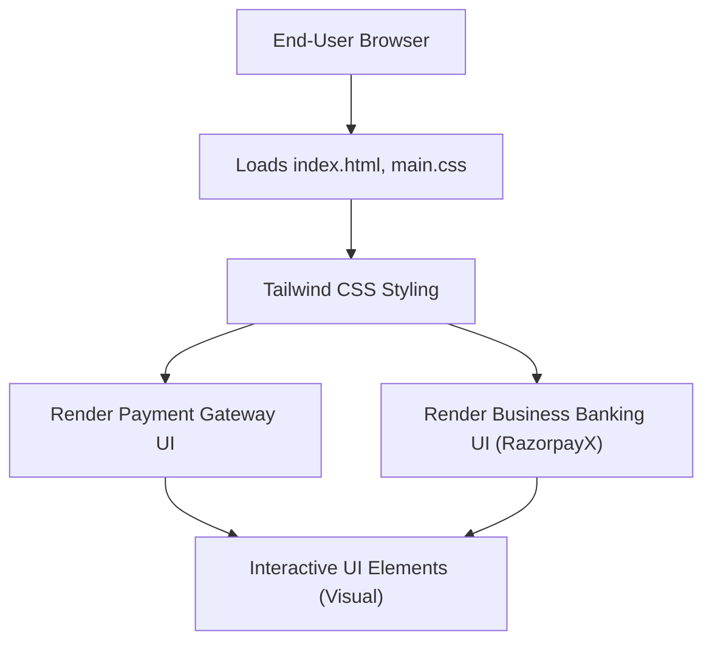

# 🚀 Razorpay Clone

<p align="center"></p>

## Short Description
Dive into a meticulously crafted frontend clone of Razorpay, India's leading payment gateway. This project stands as a testament to modern web development, showcasing a pixel-perfect replica of Razorpay's sophisticated user interface for both its payment gateway and business banking (RazorpayX) offerings. Experience the elegance and functionality of a world-class fintech platform directly in your browser.

## ✨ Key Features
*   **Comprehensive Payment Gateway UI:** Explore the visual representation of Razorpay's robust payment processing features, including various payment modes, payment links, and payment pages.
*   **Intuitive Business Banking (RazorpayX) Interface:** Get a glimpse into the seamless UI for business banking operations, covering payouts, smart collect, current accounts, and more.
*   **Dynamic Dashboard & Reporting:** Visualizations hinting at detailed analytics and reporting capabilities, designed for business insights.
*   **Seamless Integration Visuals:** Mockups reflecting easy integration points for developers and businesses.
*   **Advanced Features Showcase:** Includes UI elements for Subscription management, Magic Checkout, and UPI Autopay.
*   **Responsive & Modern Design:** Built with a keen eye for detail, ensuring a fluid experience across various devices.
*   **Security & Simplicity Highlights:** Icons and imagery suggesting a secure, user-friendly, and transparent pricing structure.

## Who is this for?
*   **Frontend Developers:** A fantastic resource for learning and demonstrating advanced HTML, CSS, and Tailwind CSS techniques by replicating a real-world, complex UI.
*   **UI/UX Designers:** An inspirational showcase of modern fintech design principles, interactions, and aesthetic execution.
*   **Fintech Enthusiasts:** Anyone interested in understanding the user-facing elements of payment gateways and business banking platforms.
*   **Educators & Students:** A practical example for teaching and learning about responsive web design and frontend architecture.

## Technology Stack & Architecture
This project is a purely frontend marvel, built using a modern stack designed for performance and maintainability:

*   **HTML:** The structural backbone of the web pages.
*   **CSS:** Styling definitions, enhanced and streamlined with a utility-first approach.
*   **Tailwind CSS:** A highly customizable CSS framework that enables rapid UI development with utility classes.
*   **PostCSS:** Used in conjunction with Tailwind CSS for processing and transforming CSS with JavaScript.
*   **NPM:** Manages development dependencies for tooling like Tailwind CSS.

## 📊 Architecture & Database Schema
Given this is a frontend UI clone, there isn't a traditional backend architecture or database schema to depict. Instead, we visualize the user's interaction with the rich interface:



## ⚡ Quick Start Guide
Get this stunning Razorpay clone up and running in no time!

1.  **Clone the repository:**
    ```bash
    git clone https://github.com/grewal16/Razorpay_clone.git
    ```
2.  **Navigate into the project directory:**
    ```bash
    cd Razorpay_clone
    ```
3.  **Install dependencies:**
    This project uses `npm` for managing development dependencies, primarily for Tailwind CSS.
    ```bash
    npm install
    ```
4.  **Open the project:**
    Simply open the `index.html` file in your web browser.
    ```bash
    open index.html # On macOS
    start index.html # On Windows
    xdg-open index.html # On Linux
    ```