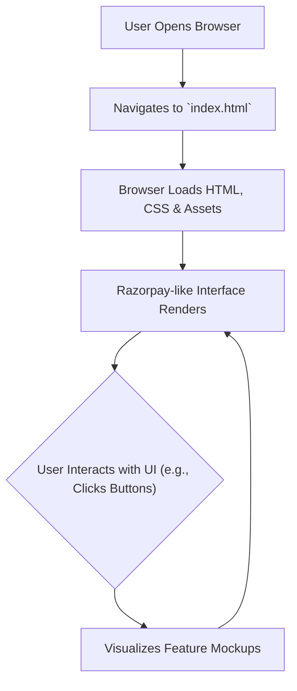

# 🚀 Razorpay UI Clone

<p align="center"></p>

## Short Description

Dive into a pixel-perfect, front-end replica of the renowned Razorpay interface! This project meticulously recreates the sleek design and intuitive user experience of a modern payment gateway, built entirely with HTML and the powerful utility-first framework, Tailwind CSS. Perfect for developers looking to understand complex UI structures, master modern CSS techniques, or simply showcase an impressive front-end development portfolio piece.

## ✨ Key Features

*   **Stunning Visual Fidelity:** A faithful recreation of the Razorpay platform's aesthetics, capturing every detail.
*   **Responsive Design:** Optimized for a seamless experience across all devices, from desktops to mobile phones.
*   **Comprehensive Feature Showcase:** Includes mockups for core payment gateway functionalities like:
    *   Payment Gateways
    *   Payouts & Business Banking (`RazorpayX`)
    *   Subscription Management & UPI Autopay
    *   Instant Settlements
    *   Magic Checkout & Payment Buttons
    *   Dashboard & Reporting Interfaces
*   **Modern CSS Architecture:** Leverages Tailwind CSS for efficient, scalable, and maintainable styling.
*   **Developer-Friendly Structure:** Clear HTML markup and well-organized assets make it easy to explore and extend.

## Who is this for?

*   **Front-end Developers:** A fantastic resource for learning advanced HTML and Tailwind CSS applications.
*   **UI/UX Designers:** A high-fidelity reference for designing payment interfaces and complex web applications.
*   **Students & Learners:** An excellent project to dissect and understand real-world web development patterns.
*   **Portfolio Builders:** A visually impressive demonstration of your front-end development skills.
*   **Businesses/Startups:** Ideal for quick prototyping or conceptualizing payment-related UI elements.

## Technology Stack & Architecture

This project is a pure front-end masterpiece, focusing entirely on the user interface and experience.

*   **HTML5:** The backbone of the page structure.
*   **Tailwind CSS:** For incredibly fast and efficient styling, driving a consistent design system.
*   **PostCSS:** Used in conjunction with Tailwind CSS for processing and optimizing CSS.
*   **Node.js (npm):** For managing development dependencies and running build scripts (e.g., Tailwind CLI).

## 📊 Architecture & Database Schema

As a front-end UI clone, this project does not include a backend server or database schema. Its architecture is client-side rendered, focusing on static content presentation and interactive UI elements.

Here's a conceptual flow of how a user interacts with this UI clone:



## ⚡ Quick Start Guide

Getting started with this project is straightforward:

1.  **Clone the repository:**
    ```bash
    git clone https://github.com/grewal16/Razorpay_clone.git
    cd Razorpay_clone
    ```
2.  **Install Dependencies:**
    This project uses Node.js and npm for Tailwind CSS compilation.
    ```bash
    npm install
    ```
3.  **Build/Watch Tailwind CSS:**
    To ensure Tailwind CSS is compiled and applied correctly, you'll want to run the build process. For development, a watch command is useful:
    ```bash
    # For development (watches for changes)
    npx tailwindcss -i ./main.css -o ./dist/output.css --watch

    # For production build
    npx tailwindcss -i ./main.css -o ./dist/output.css --minify
    ```
    *Note: The actual output file might be `main.css` itself, depending on `tailwind.config.js`. Please verify `package.json` scripts if any, or link `main.css` directly.*
4.  **Open `index.html`:**
    Simply open the `index.html` file in your web browser to view the live clone!

## 📜 License

No specific license file was found in the repository. Please contact the repository owner for licensing information.