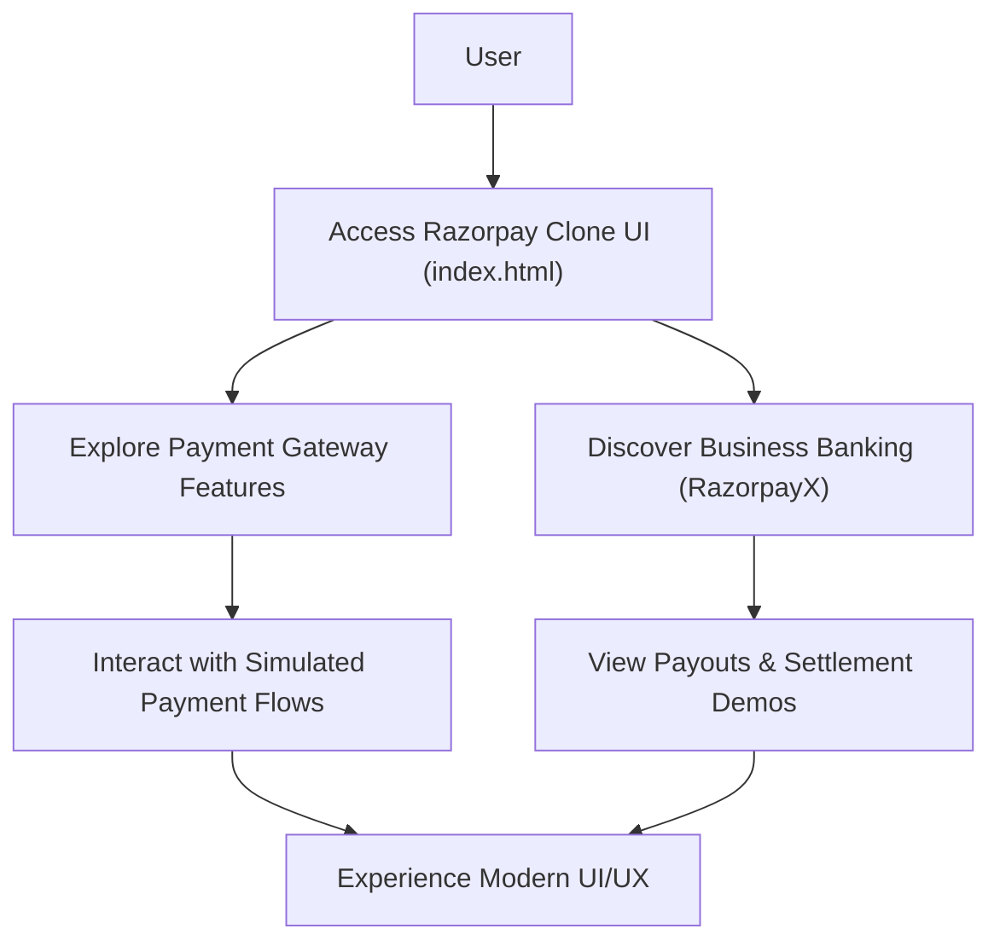

# 🚀 Razorpay_clone

<p align="center"></p>

## Short Description

Dive into a meticulously crafted, high-fidelity UI clone of the renowned Razorpay payment gateway and business banking platform. This project serves as a showcase for modern web development techniques, replicating the intricate designs and comprehensive features of a leading FinTech service. It's a testament to front-end capabilities, delivering a pixel-perfect user experience without the underlying backend logic.

## ✨ Key Features

*   **Stunning UI/UX Replication:** Experience a faithful recreation of Razorpay's intuitive and modern user interface, designed for optimal user engagement.
*   **Comprehensive Payment Gateway Interface:** Explore simulated flows for accepting payments, encompassing various payment modes and checkout experiences.
*   **Advanced Business Banking Features (RazorpayX inspired):** Navigate through dashboards and features mimicking RazorpayX, including payouts, instant settlements, and smart collect functionalities.
*   **Seamless Integration Showcase:** Visual representation of API-driven features and easy integration points.
*   **Subscription & Autopay Demos:** Interactive elements demonstrating recurring payments and UPI autopay capabilities.
*   **Optimized for Modern Web:** Built with contemporary front-end tools for a responsive and visually appealing design.

## Who is this for?

This project is ideal for:
*   **Front-end Developers:** Seeking inspiration or a challenging project to understand complex UI/UX implementations.
*   **UI/UX Designers:** To study and deconstruct the design patterns of a successful FinTech platform.
*   **Aspiring FinTech Engineers:** To get a hands-on feel for the visual components of a payment gateway.
*   **Learners:** To grasp the application of modern CSS frameworks and front-end architecture in a real-world context.

## Technology Stack & Architecture

This project is built using a modern and efficient front-end stack:

*   **HTML5:** For semantic and structured content.
*   **CSS3:** Styling achieved through utility-first principles.
*   **Tailwind CSS:** Rapidly building custom designs with a highly configurable utility framework.
*   **PostCSS:** For transforming CSS with JavaScript plugins, enabling features like autoprefixing and custom syntax.
*   **Node.js (Tooling):** Utilizing `package.json` for dependency management and build processes.

## 📊 Architecture & Database Schema

As a front-end UI clone, this project primarily focuses on the user interaction layer. There is no traditional database schema. Below is a high-level flowchart illustrating the user journey through the cloned interface:



## ⚡ Quick Start Guide

Get this impressive Razorpay UI clone up and running in no time!

1.  **Clone the Repository:**
    ```bash
    git clone https://github.com/grewal16/Razorpay_clone.git
    cd Razorpay_clone
    ```

2.  **Install Dependencies:**
    This project uses `npm` for dependency management.
    ```bash
    npm install
    ```

3.  **View the Project:**
    Simply open the `index.html` file in your preferred web browser. For a local development server experience, you might use a tool like Live Server or a similar utility.

    ```bash
    # For a quick view (no server needed for static files)
    # Open 'index.html' directly in your browser
    ```