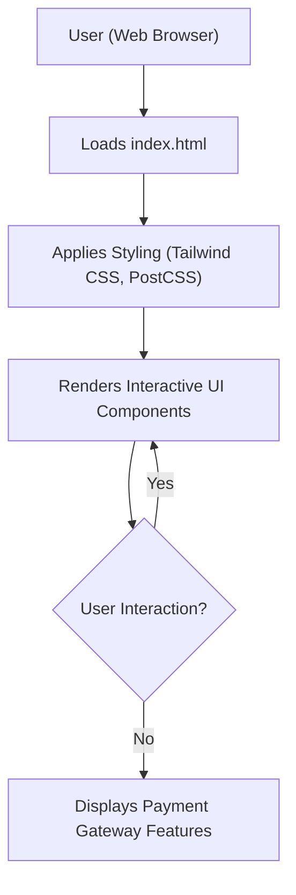

# 🚀 Razorpay Clone

<p align="center"></p>

## Short Description

Dive into a meticulously crafted front-end clone of the Razorpay website, a leading fintech platform. This project is a testament to modern web development, focusing on delivering a pixel-perfect, highly responsive, and feature-rich user interface. It serves as an excellent reference for replicating complex UI designs and mastering contemporary front-end practices.

## ✨ Key Features

*   **Comprehensive Payment Gateway UI:** Experience the visual representation of a robust payment processing interface.
*   **Business Banking & Payouts Simulation:** Explore mockups for managing business finances, including payouts and capital credit.
*   **Instant Settlement & Dashboard Reporting Views:** Visualize dashboards showing instant settlements and detailed reporting functionalities.
*   **API-Driven Concept Icons:** Showcases iconography suggestive of powerful, easily integratable API functionalities.
*   **Diverse Payment Solutions:** Includes UI elements for Payment Links, Payment Pages, Magic Checkout, and UPI Autopay.
*   **Secure & User-Friendly Design:** Reflects a focus on security and ease of use in financial transactions.
*   **Modern, Responsive Layout:** Built to look stunning and perform flawlessly across all devices and screen sizes.

## Who is this for?

This project is ideal for:

*   **Front-End Developers:** A fantastic resource for studying advanced CSS techniques, responsive design, and component-based UI structures.
*   **UI/UX Designers:** Gain insights into how complex fintech interfaces are translated into functional web designs.
*   **Learners:** A hands-on project to understand the interplay of HTML, CSS frameworks like Tailwind CSS, and modern asset management in a real-world context.
*   **Fintech Enthusiasts:** Explore the visual blueprint of a renowned payment gateway without diving into backend complexities.

## Technology Stack & Architecture

This project is a pure front-end masterpiece, engineered with modern web technologies:

*   **HTML5:** The foundational markup language for structuring content.
*   **CSS3:** For styling, enhanced by the utility-first approach of Tailwind CSS.
*   **Tailwind CSS:** A highly customizable CSS framework enabling rapid UI development and ensuring responsiveness.
*   **PostCSS:** Used for transforming CSS with JavaScript plugins, integrated seamlessly with Tailwind.
*   **JavaScript (Implied):** While no explicit `.js` files are listed beyond `package.json`, client-side interactions and dynamic UI elements are an inherent part of such a clone.
*   **npm/Yarn:** For managing project dependencies and scripting development workflows.

## 📊 Architecture & Database Schema

As a purely front-end, UI-focused project, there isn't a traditional backend architecture or database schema to display. Instead, the "architecture" centers on how the user interacts with and perceives the application's flow in the browser.



## ⚡ Quick Start Guide

Get this impressive UI clone up and running on your local machine in no time:

1.  **Clone the Repository:**
    ```bash
    git clone https://github.com/grewal16/Razorpay_clone.git
    cd Razorpay_clone
    ```
2.  **Install Dependencies:**
    ```bash
    npm install
    ```
    This will set up all the necessary PostCSS and Tailwind CSS tooling.
3.  **Open in Browser:**
    Simply open the `index.html` file in your preferred web browser:
    ```bash
    open index.html
    ```
    Alternatively, you might use a local development server for better live-reloading capabilities, often configured via `npm start` or `npm run dev` scripts if defined in `package.json`.

---