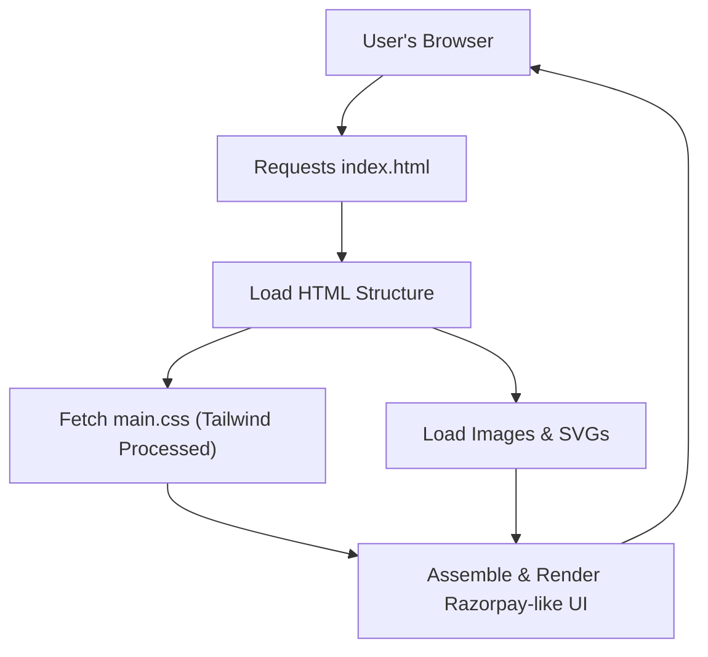

# 🚀 Razorpay_clone

<p align="center"></p>

## Short Description
Dive into a meticulously crafted, pixel-perfect front-end clone of the renowned Razorpay payment gateway interface. This project is a testament to modern web development, showcasing a high-fidelity reproduction of Razorpay's captivating user experience, feature-rich presentation, and elegant design, all built with a keen eye on detail and responsive behavior. It's a dynamic demonstration of what's possible with HTML and Tailwind CSS.

## ✨ Key Features
*   **Dynamic Payment Gateway UI:** Experience a recreated interface that mimics Razorpay's intuitive payment flow, supporting a wide array of payment modes and transaction types.
*   **Comprehensive Business Banking Showcase:** Explore visual elements reminiscent of RazorpayX, including current accounts, capital management, and simplified payouts, designed for business financial operations.
*   **Instant Settlement & Autopay Representations:** Witness the visual implementation of fast transaction processing and streamlined recurring payment setups for efficient financial management.
*   **Advanced Payment Tools Visualized:** Features concepts like customizable Payment Links, dedicated Payment Pages, and an illustration of Magic Checkout for a seamless buyer experience.
*   **API-Driven Solutions Overview:** Highlights the powerful, flexible nature of API-first payment integration, showcasing how businesses can easily embed payment capabilities.
*   **Dashboard & Reporting Concepts:** Includes design elements suggesting sophisticated analytics and real-time financial reporting for a clear overview of business performance.
*   **Modern & Responsive Design:** Engineered with Tailwind CSS to deliver a sleek, adaptable user interface that performs flawlessly across various devices and screen sizes.
*   **Secure Transaction Visual Cues:** Incorporates design elements indicating robust security protocols and compliance standards for building user trust.

## Who is this for?
*   **Front-end Developers:** Ideal for those seeking a challenging project to hone their HTML, CSS (especially Tailwind CSS), and responsive design skills by replicating a complex, real-world interface.
*   **UI/UX Designers:** A valuable resource for studying the implementation details of a leading payment gateway's user interface and experience.
*   **Students & Learners:** Perfect for understanding the architectural decisions and component breakdown in building a professional web presence.
*   **Inspiration Seekers:** Anyone interested in modern web development practices, clean code, and effective UI replication.

## Technology Stack & Architecture
This project is a pure front-end application, emphasizing UI/UX design and implementation.
*   **HTML5:** For structuring the semantic content of the web pages.
*   **CSS3:** Primarily styled using the utility-first framework **Tailwind CSS**, enabling rapid UI development and consistent design.
*   **PostCSS:** Used for CSS transformation and optimization, enhancing performance and maintainability.
*   **Node.js / npm:** Utilized for managing development dependencies and executing build scripts (e.g., Tailwind CLI).
*   **Pure Front-end Application:** Demonstrates comprehensive UI capabilities without relying on any backend logic or database integration.

## 📊 Architecture & Database Schema

The architecture of this project is focused solely on the client-side presentation layer, showcasing the structured delivery of a rich user interface.



## ⚡ Quick Start Guide
Get this Razorpay UI clone up and running in minutes!

1.  **Clone the repository:**
    ```bash
    git clone https://github.com/grewal16/Razorpay_clone.git
    ```
2.  **Navigate to the project directory:**
    ```bash
    cd Razorpay_clone
    ```
3.  **Install dependencies:**
    ```bash
    npm install
    ```
    This command will install all necessary development dependencies, including Tailwind CSS and PostCSS, as defined in `package.json`.

4.  **Start the Tailwind CSS watcher:**
    ```bash
    npm start
    ```
    This script will compile your `main.css` into `dist/output.css` and automatically watch for any changes you make to your HTML or CSS files, rebuilding as needed.

5.  **Open `index.html`:**
    Open the `index.html` file in your preferred web browser. For the best development experience with live reloading, consider using a live server extension (e.g., "Live Server" for VS Code).