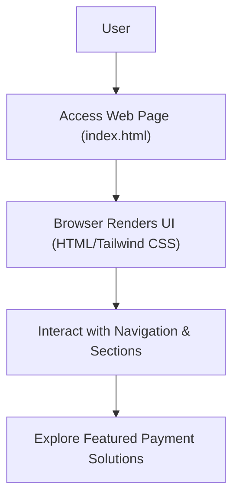

# 🚀 Razorpay UI Clone: Modern Payment Gateway Experience

<p align="center"></p>

## Short Description

Dive into a pixel-perfect, highly responsive frontend clone of the Razorpay website. This project meticulously recreates the intuitive user interface of a leading payment gateway, showcasing a robust and modern web development approach with a focus on UI/UX excellence.

## ✨ Key Features

*   **Comprehensive Payment Solutions UI:** Experience the user interfaces for various payment functionalities, including Payment Gateways, Links, Pages, Buttons, Magic Checkout, and UPI Autopay.
*   **Advanced Business Banking (RazorpayX) Experience:** Explore UI elements designed for managing payouts, corporate cards, and other sophisticated business banking features.
*   **Seamless Subscription Management:** Discover the interface for handling recurring payments and subscription services with ease.
*   **Intuitive Dashboard & Reporting Views:** Visually organized sections for transaction overviews, analytics, and financial reporting.
*   **Modern & Responsive Design:** Crafted with a mobile-first philosophy, guaranteeing a flawless experience across all devices and screen sizes.
*   **Optimized Performance & Scalability:** Built using contemporary frontend tools for a lean, maintainable, and extensible codebase.

## Who is this for?

*   **Frontend Developers:** A hands-on project for mastering responsive design, utility-first CSS frameworks like Tailwind CSS, and implementing complex, visually rich user interfaces.
*   **UI/UX Designers:** An invaluable resource for dissecting effective interaction patterns, visual hierarchy, and the overall user journey in financial technology applications.
*   **Aspiring Web Developers:** An excellent showcase to understand the structure and styling of enterprise-grade landing pages and product feature displays.
*   **Educational Institutions:** A perfect example for demonstrating modern HTML5, CSS3, and contemporary build process best practices.

## Technology Stack & Architecture

This project is a pure frontend implementation, leveraging best-in-class tools for a performant and maintainable codebase:

*   **HTML5:** Providing the semantic structure and content foundation.
*   **CSS3 & Tailwind CSS:** For rapid, utility-first styling that ensures a fully responsive and highly customizable design.
*   **PostCSS:** Used for processing CSS, integrating seamlessly with Tailwind CSS.
*   **NPM:** Facilitates efficient package management for all development dependencies and build scripts.

## 📊 Architecture & Database Schema

As this is a static UI clone focused solely on the frontend presentation, there is no backend architecture or database schema involved. The project's structure can be understood through a simple user interaction flow:



## ⚡ Quick Start Guide

Get this beautiful UI running on your local machine in no time!

1.  **Clone the repository:**
    ```bash
    git clone https://github.com/grewal16/Razorpay_clone.git
    cd Razorpay_clone
    ```
2.  **Install dependencies:**
    ```bash
    npm install
    ```
    This command will set up all the necessary packages, including Tailwind CSS and PostCSS.
3.  **Build Tailwind CSS:**
    ```bash
    npm run build
    ```
    This step processes your CSS, compiling the Tailwind utility classes into the final `main.css` file.
4.  **Open in browser:**
    Simply open the `index.html` file in your preferred web browser to experience the Razorpay UI clone.

## 📜 License

No license file was explicitly provided in the repository. Please refer to the repository owner for licensing information.