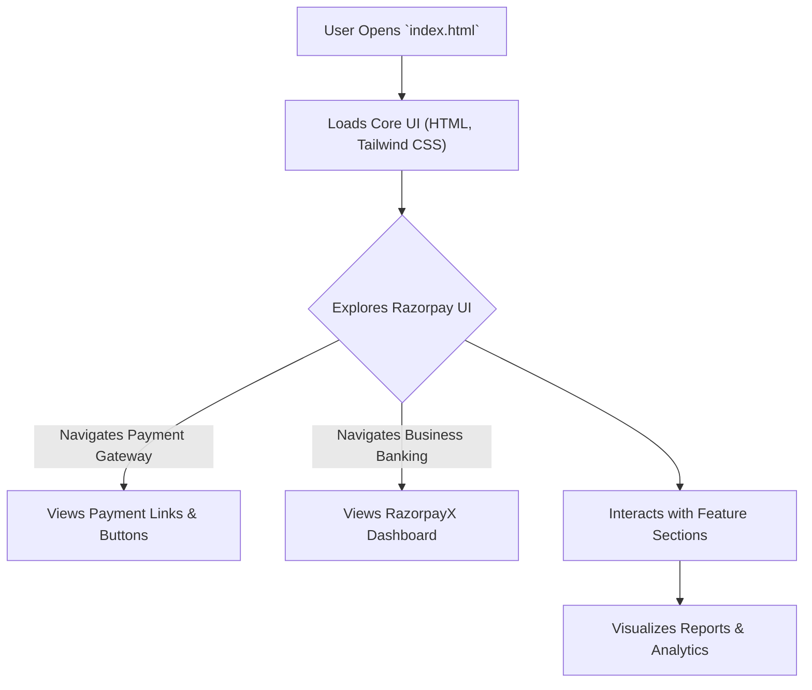

# 🚀 Razorpay UI Clone

<p align="center"></p>

## Short Description

Dive into the meticulously crafted frontend clone of Razorpay, India's leading payment gateway. This project stands as a testament to modern web development, showcasing a pixel-perfect, highly responsive, and feature-rich user interface that mirrors the sophistication and intuitive design of the original platform. Built for performance and aesthetics, it provides a comprehensive visual representation of a cutting-edge financial technology interface, designed to inspire and educate.

## ✨ Key Features

*   **Stunning UI/UX:** Experience a visually identical and highly engaging user interface, capturing the essence of Razorpay's design language.
*   **Comprehensive Payment Gateway Features:** Explore mockups for various payment functionalities, including Payment Links, Pages, Buttons, and Magic Checkout, replicating a seamless transaction flow.
*   **Advanced Business Banking (RazorpayX):** Delve into the UI elements representing business-centric financial services like Payouts, Smart Collect, Capital & Credit, and Corporate Cards.
*   **Intuitive Dashboard & Reporting:** Visualize interfaces for robust analytics and reporting, essential for financial oversight.
*   **Adaptive & Responsive Design:** Crafted with modern CSS (Tailwind CSS) to ensure a flawless experience across all devices.
*   **Developer-Friendly Structure:** A clean, well-organized codebase, ideal for learning and understanding modern frontend development practices.
*   **Iconography & Illustrations:** Integrates a rich set of SVG icons and illustrative assets that bring the interface to life.

## Who is this for?

*   **Frontend Developers:** A valuable resource for those looking to study and implement complex, modern UI designs using HTML, CSS (Tailwind CSS), and JavaScript principles.
*   **UI/UX Designers:** An excellent reference for understanding how leading fintech platforms structure their visual elements and user flows.
*   **Learners & Students:** An engaging project to dissect and comprehend responsive design, component-based thinking, and high-fidelity cloning.
*   **Startups & Innovators:** Gain inspiration for designing intuitive and powerful payment or financial service interfaces.

## Technology Stack & Architecture

This project is a pure frontend showcase, demonstrating robust UI development practices.

*   **HTML5:** The backbone for structuring all content and elements.
*   **CSS3 (Tailwind CSS):** Utilizes the utility-first framework for rapid, consistent, and highly customizable styling, ensuring responsiveness and maintainability. PostCSS is used for processing CSS.
*   **JavaScript:** Implied for interactive elements and dynamic UI behavior (though not extensively present as explicit JS files beyond typical build configurations, interaction is primarily visual).
*   **npm/yarn:** Package management for development dependencies (e.g., PostCSS, Tailwind CSS).

## 📊 Architecture & Database Schema

As this project focuses solely on frontend UI replication, there is no traditional backend architecture or database schema involved. The "architecture" represents the user's interaction flow with the static UI.



## ⚡ Quick Start Guide

To get this stunning UI up and running on your local machine:

1.  **Clone the Repository:**
    ```bash
    git clone https://github.com/grewal16/Razorpay_clone.git
    cd Razorpay_clone
    ```

2.  **Install Dependencies:**
    This project uses `npm` for managing development dependencies, primarily for Tailwind CSS.
    ```bash
    npm install
    ```

3.  **Build Tailwind CSS (if needed):**
    If you make changes to `tailwind.config.js` or `main.css`, you might need to recompile the CSS. A common command for development is:
    ```bash
    npm run dev # Or similar command defined in package.json for development watch
    # or for production build
    npm run build # Or similar command defined in package.json for production
    ```
    *Note: The `package.json` suggests a build setup for Tailwind CSS, so ensure the necessary build commands are run.*

4.  **Open in Browser:**
    Simply open the `index.html` file in your preferred web browser.
    ```bash
    open index.html # On macOS
    start index.html # On Windows
    xdg-open index.html # On Linux
    ```
    Alternatively, use a live server extension in your IDE for a more dynamic development experience.