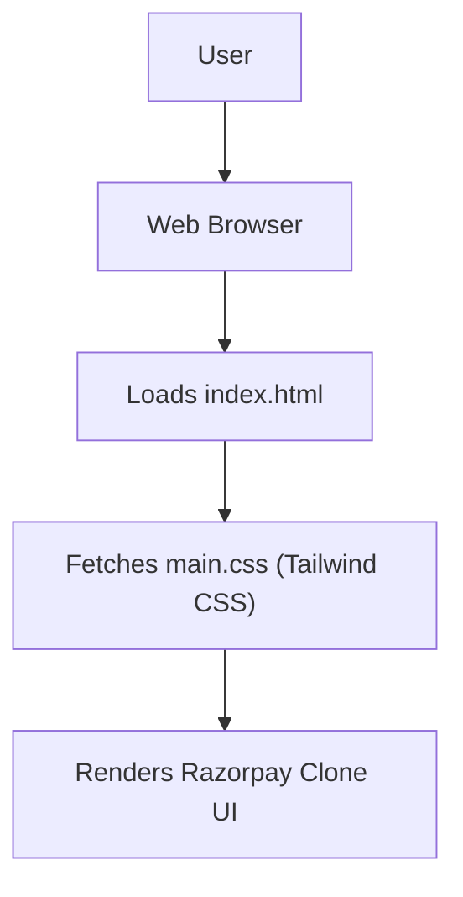

# 🚀 Razorpay Clone UI

<p align="center"></p>

## Short Description
Dive into the world of seamless financial interfaces with the Razorpay Clone UI! This project is a meticulously crafted, pixel-perfect frontend replication of the Razorpay payment gateway experience, built with modern web technologies. It showcases an intuitive and responsive user interface, mirroring key features of a leading fintech platform to demonstrate robust UI development capabilities.

## ✨ Key Features
*   **Stunning UI Replication:** A faithful recreation of Razorpay's modern, clean, and intuitive design.
*   **Comprehensive Payment Suite Overview:** Visually represents various payment options, including Payment Gateway, Payment Links, Payment Pages, and Subscriptions.
*   **RazorpayX Business Banking Interface:** Explores the UI elements for advanced business banking features like Payouts, Current Accounts, and Capital & Credit.
*   **Instant Settlement & Magic Checkout:** Highlights user interface flows for rapid transactions and optimized checkout experiences.
*   **Responsive Design:** Engineered to look great and perform flawlessly across all devices.
*   **Interactive Elements:** Showcases dynamic UI components and engaging micro-interactions.

## Who is this for?
This project is ideal for:
*   Frontend developers seeking to study a high-fidelity UI clone.
*   UI/UX designers looking for inspiration or a reference for complex fintech interfaces.
*   Recruiters evaluating candidates' ability to build sophisticated and responsive web UIs.
*   Anyone interested in the visual mechanics and structure of a world-class payment gateway's frontend.

## Technology Stack & Architecture
This project is built using a modern, efficient, and widely adopted frontend stack:

*   **HTML5:** For structuring the core content of the web pages.
*   **CSS3:** For styling, ensuring a visually appealing and responsive layout.
*   **Tailwind CSS:** A utility-first CSS framework for rapidly building custom designs without leaving your HTML.
*   **PostCSS:** For transforming CSS with JavaScript, enabling Tailwind CSS and other modern CSS features.
*   **npm:** For managing project dependencies and automating frontend tasks.

## 📊 Architecture & Database Schema
This project is a purely client-side UI replication and does not involve a backend server or a database. The architecture is focused on delivering a rich, interactive user experience directly in the browser.



## ⚡ Quick Start Guide
To get a local copy of this project up and running, follow these simple steps:

1.  **Clone the repository:**
    ```bash
    git clone https://github.com/grewal16/Razorpay_clone.git
    cd Razorpay_clone
    ```
2.  **Install dependencies:**
    ```bash
    npm install
    ```
    This will install Tailwind CSS and PostCSS dependencies.
3.  **Open the project:**
    Simply open the `index.html` file in your preferred web browser to view the live UI clone. If you want to make changes and have Tailwind recompile, you might need a local development server or run a watch command for Tailwind. (Check `package.json` for specific dev scripts, typically `npm run dev` or `npm start`).

Enjoy exploring the Razorpay Clone UI!