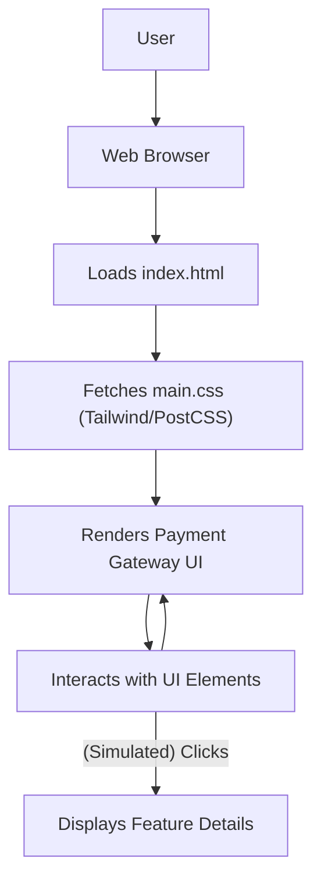

# 🚀 Razorpay Clone: Modern Payment Interface Replication

<p align="center"></p>

## Short Description
Dive into the meticulously crafted **Razorpay Clone**, a sophisticated frontend project that replicates the sleek and intuitive user interface of the renowned Razorpay payment gateway. This project showcases advanced UI/UX implementation, responsive design principles, and a deep understanding of modern web development practices to deliver a visually stunning and highly interactive experience. It's a testament to precision and attention to detail in mirroring a complex, real-world application's design.

## ✨ Key Features
*   **Pixel-Perfect UI Replication:** A faithful recreation of Razorpay's key pages and components, demonstrating mastery of intricate design systems.
*   **Comprehensive Payment Features Showcase:** Visual representation of payment gateways, links, pages, subscriptions, and UPI autopay functionalities.
*   **Business Banking Interface:** Detailed sections illustrating business banking services, payouts, and smart collect features, mirroring the RazorpayX experience.
*   **Responsive & Adaptive Design:** Ensures a seamless experience across all devices, from desktops to mobile phones, utilizing a mobile-first approach.
*   **Modern Styling with Tailwind CSS:** Leverages the power of Tailwind CSS for rapid and consistent styling, showcasing utility-first development.
*   **Dynamic Interactive Elements:** Includes various interactive components such as call-to-action sections, feature highlights, and testimonial carousels.

## Who is this for?
This project is ideal for:
*   **Frontend Developers:** Looking for an exemplary project to study modern UI replication techniques and responsive design.
*   **UI/UX Designers:** Seeking inspiration or a reference for complex, enterprise-grade web interfaces.
*   **Learners:** Interested in understanding how professional-grade payment interfaces are structured and styled.
*   **Businesses & Startups:** Exploring payment gateway UI/UX patterns for their own applications.

## Technology Stack & Architecture
The Razorpay Clone is built as a highly performant and maintainable frontend application, focusing on clean code and robust design.

*   **HTML5:** Structured and semantic markup for core content.
*   **CSS3:** Enhanced styling capabilities.
*   **Tailwind CSS:** A utility-first CSS framework for rapid and consistent styling, enabling highly customizable and responsive designs.
*   **PostCSS:** Used in conjunction with Tailwind CSS for efficient CSS processing.
*   **JavaScript:** For interactive elements and dynamic content manipulation (implied by `package.json` for modern frontend tooling).

## 📊 Architecture & Database Schema
Given this is a pure frontend replication, there is no backend database schema. The architecture focuses on client-side rendering and user interface flow.



## ⚡ Quick Start Guide
To get this project up and running locally, follow these simple steps:

1.  **Clone the repository:**
    ```bash
    git clone https://github.com/grewal16/Razorpay_clone.git
    cd Razorpay_clone
    ```
2.  **Install dependencies:**
    This project uses `npm` for package management, primarily for Tailwind CSS and PostCSS tooling.
    ```bash
    npm install
    ```
3.  **Run a build (optional, for development changes):**
    If you make changes to Tailwind configuration or styles, you might need to rebuild the CSS.
    ```bash
    npm run dev
    # or npm run build for production
    ```
4.  **Open in browser:**
    Simply open the `index.html` file in your preferred web browser.
    ```bash
    open index.html # On macOS
    # or start index.html # On Windows
    # or xdg-open index.html # On Linux
    ```
    Alternatively, use a live server extension in your IDE (like VS Code's Live Server) for hot-reloading.