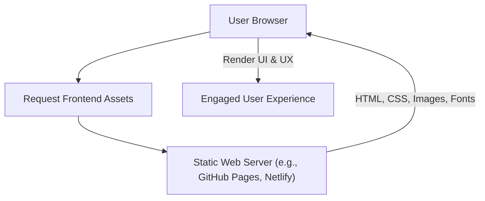

# 🚀 Razorpay_clone

<p align="center"></p>

## Short Description
Dive into a meticulously crafted **frontend recreation** of a leading fintech platform's public-facing website. This project, `Razorpay_clone`, showcases a pixel-perfect implementation of modern UI/UX design principles, responsive layouts, and interactive elements, all built with a keen eye for detail and performance. It's a testament to crafting engaging and high-fidelity web experiences for the financial technology sector.

## ✨ Key Features
*   **Authentic UI/UX Replication:** Experience a faithful recreation of Razorpay's intuitive user interface and compelling user experience.
*   **Comprehensive Feature Demonstrations:** Explore sections mimicking key fintech offerings such as Payment Gateway, Business Banking, Payouts, Subscriptions, and more, as inferred from the rich collection of icons and illustrations.
*   **Responsive Design Excellence:** Built with TailwindCSS, this clone adapts seamlessly across various devices, ensuring a consistent and optimal viewing experience.
*   **Rich Visual Assets:** A vibrant array of SVG icons and illustrative imagery (`images/`) brings the complex world of fintech to life with clarity and modern aesthetics.
*   **Clean & Modular Codebase:** Structured HTML and efficient CSS (powered by TailwindCSS) provide a solid foundation for understanding modern web development practices.
*   **Static Site Performance:** Optimized for speed and direct deployment as a static website.

## Who is this for?
*   **Frontend Developers:** A perfect resource for studying advanced CSS techniques, responsive design with TailwindCSS, and complex UI structures.
*   **UI/UX Designers:** Gain insight into how design concepts translate into a functional, aesthetically pleasing web application in the fintech domain.
*   **Aspiring Web Developers:** A hands-on project to learn modern web development workflows, including asset management and build processes.
*   **Anyone Interested in Fintech UI:** Explore the visual language and interaction patterns of a prominent financial technology platform.

## Technology Stack & Architecture
This project is a purely frontend-driven application, leveraging modern web technologies to deliver a robust and visually appealing user interface.

*   **HTML5:** For semantic and structured content delivery.
*   **CSS3:** Custom styles, enhanced by a utility-first framework.
*   **TailwindCSS:** A highly customizable, utility-first CSS framework for rapid UI development and ensuring responsive behavior across all screen sizes.
*   **JavaScript:** (Implied for potential interactive elements and build processes, though no direct `.js` files are exposed in the core application logic).
*   **Node.js & npm/Yarn:** For managing project dependencies and facilitating the TailwindCSS build process (`package.json`, `package-lock.json`, `postcss.config.js`, `tailwind.config.js`).

## 📊 Architecture & Database Schema
Given this is a static frontend project, there's no backend database schema. The architecture focuses on the client-side rendering and asset delivery.



## ⚡ Quick Start Guide
To get this Razorpay clone up and running on your local machine, follow these simple steps:

1.  **Clone the repository:**
    ```bash
    git clone https://github.com/grewal16/Razorpay_clone.git
    ```
2.  **Navigate to the project directory:**
    ```bash
    cd Razorpay_clone
    ```
3.  **Install dependencies:**
    This project uses TailwindCSS, which requires a build step. Ensure you have Node.js and npm (or Yarn) installed.
    ```bash
    npm install
    # or
    yarn install
    ```
4.  **Build TailwindCSS:**
    To process the TailwindCSS directives and generate the final `main.css` file:
    ```bash
    npx tailwindcss -i ./main.css -o ./main.css --minify
    # Or, if a build script is defined in package.json:
    # npm run build
    ```
    *(Note: The provided `main.css` is small, indicating it's likely an input for Tailwind. The command above assumes `main.css` serves as both input and output for simplicity. Adjust `npx tailwindcss` command if your project has a different input/output setup.)*
5.  **Open in browser:**
    Simply open the `index.html` file in your preferred web browser:
    ```bash
    open index.html
    # or navigate to the file path in your browser
    ```
    You should now see the Razorpay clone live in your browser!