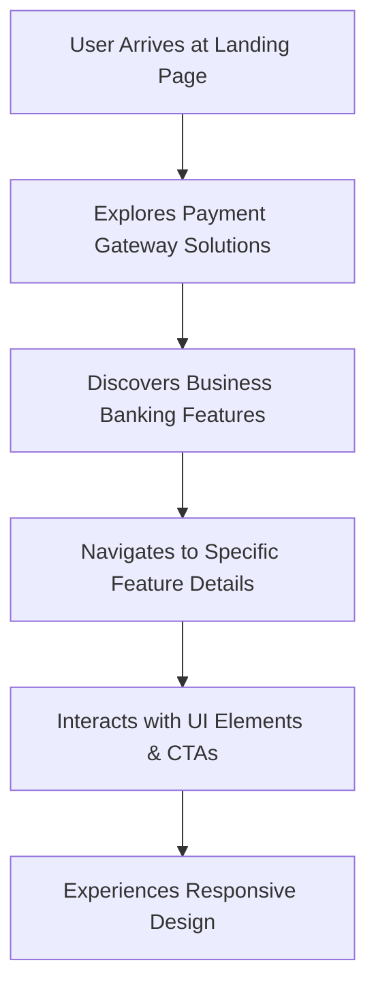

# 🚀 Razorpay_clone

<p align="center"></p>

## Short Description
Dive into a meticulously crafted, high-fidelity front-end clone of Razorpay, India's leading payment gateway. This project showcases a modern, responsive user interface and experience for a comprehensive suite of payment processing and business banking solutions, demonstrating pixel-perfect design and interactive elements. It's a testament to front-end development prowess, replicating the sophisticated aesthetic and functional feel of a real-world financial technology platform.

## ✨ Key Features
*   **Comprehensive Payment Suite:** Explore a full spectrum of payment options including a robust Payment Gateway, intuitive Payment Links, customizable Payment Pages, versatile Payment Buttons, and the innovative Magic Checkout for streamlined transactions. Supports diverse payment modes for maximum flexibility.
*   **Advanced Business Banking (RazorpayX inspired):** Delve into features resembling RazorpayX's business banking capabilities, offering insights into current accounts, capital and credit solutions, efficient payouts, and smart collection tools designed for modern businesses.
*   **Automated & Recurring Payments:** Experience seamless integration of subscription management and UPI Autopay features, crucial for recurring billing models.
*   **Instant Settlements:** Witness the immediate and reliable fund transfer capabilities, a critical aspect of financial operations.
*   **Insightful Dashboards & Reporting:** Envision powerful dashboards providing real-time analytics and comprehensive reporting for financial visibility (UI representation).
*   **Developer-Friendly Integration:** Designed with an API-driven philosophy, showcasing how easily such a platform can be integrated (UI/UX perspective).
*   **Uncompromised Security:** Visual cues and sections indicating a focus on enterprise-grade security and compliance for every transaction.

## Who is this for?
*   **Front-End Developers:** A fantastic resource for studying modern HTML, CSS (especially Tailwind CSS), and JavaScript implementations in a complex web application.
*   **UI/UX Designers:** An inspirational showcase of design patterns, iconography, and user flows within the FinTech space.
*   **Technical Marketers & Product Managers:** Ideal for understanding the typical feature sets and user journeys of a leading payment and business banking platform.
*   **Learners:** A solid foundation for anyone looking to understand how real-world applications are structured on the front end.

## Technology Stack & Architecture
This project is a pure front-end endeavor, demonstrating excellent command over:

*   **HTML5:** The structural backbone of all web content.
*   **Tailwind CSS:** For highly efficient, utility-first CSS styling, ensuring rapid development and maintainable stylesheets.
*   **PostCSS:** Used in conjunction with Tailwind CSS for powerful CSS transformations and optimizations.
*   **JavaScript:** Implied for interactive elements and potentially development tooling (via `package.json`).
*   **Node.js (Development):** Utilized for managing front-end dependencies and build processes, as indicated by `package.json` and `package-lock.json`.

There is no server-side logic or database associated with this clone; it focuses solely on the client-side user experience.

## 📊 Architecture & Database Schema
As this project is a front-end clone focused on replicating the user interface and experience, there is no underlying database schema. The architecture represents a typical client-side application flow:



## ⚡ Quick Start Guide
Get this powerful front-end clone up and running in no time!

1.  **Clone the repository:**
    ```bash
    git clone https://github.com/grewal16/Razorpay_clone.git
    cd Razorpay_clone
    ```
2.  **Install Dependencies:**
    This project uses `npm` for managing development dependencies (e.g., Tailwind CSS processing).
    ```bash
    npm install
    ```
3.  **Open in your browser:**
    Simply open the `index.html` file in your preferred web browser to view the project:
    ```bash
    open index.html # For macOS
    # or
    start index.html # For Windows
    # or navigate to the file directly
    ```
    For development with live reloading and Tailwind JIT compilation, you might need to run a local development server, typically initiated via an `npm` script defined in `package.json`. Consult `package.json` for specific scripts like `npm run dev` or `npm start`.